# Phase 3: エディタ統合設計書

**プロジェクト:** Web版Claude Code
**作成日:** 2025-12-21
**バージョン:** 1.0
**ステータス:** 🚧 実装中（0%）

---

## 目次

1. [概要](#1-概要)
2. [アーキテクチャ設計](#2-アーキテクチャ設計)
3. [エディタモード設計](#3-エディタモード設計)
4. [ファイル同期設計](#4-ファイル同期設計)
5. [実装タスク](#5-実装タスク)
6. [技術仕様](#6-技術仕様)
7. [実装優先順位](#7-実装優先順位)

---

## 1. 概要

### 1.1 目的

Phase 3では、code-server（VSCode Web）をメインエディタとして統合し、Claudeの変更をリアルタイムで反映できるようにします。code-server利用不可時はMonaco Editorをフォールバックとして使用します。

### 1.2 達成目標

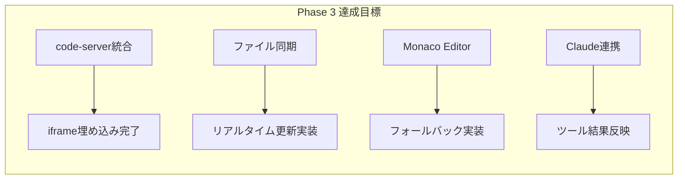

### 1.3 前提条件

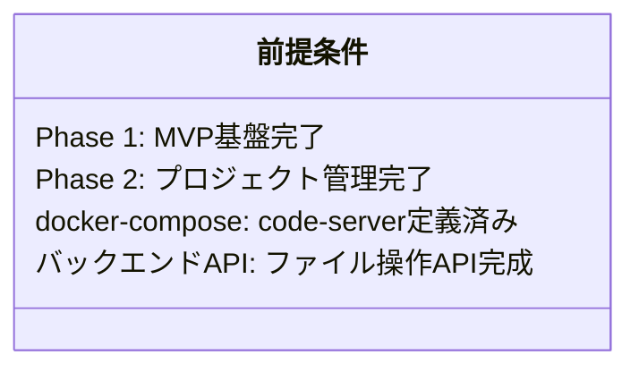

---

## 2. アーキテクチャ設計

### 2.1 システム構成

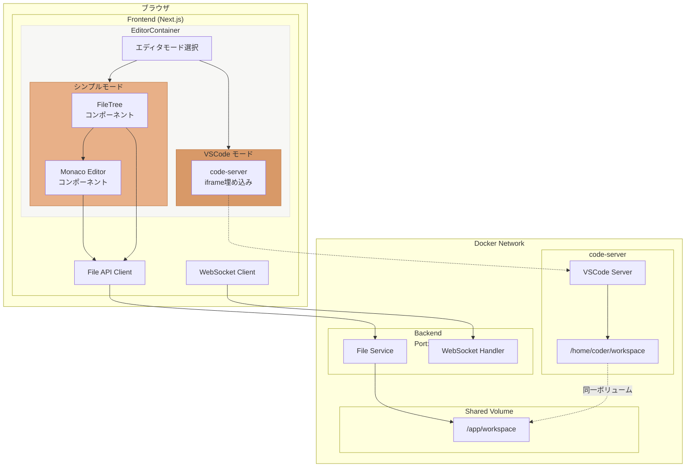

### 2.2 エディタモード比較

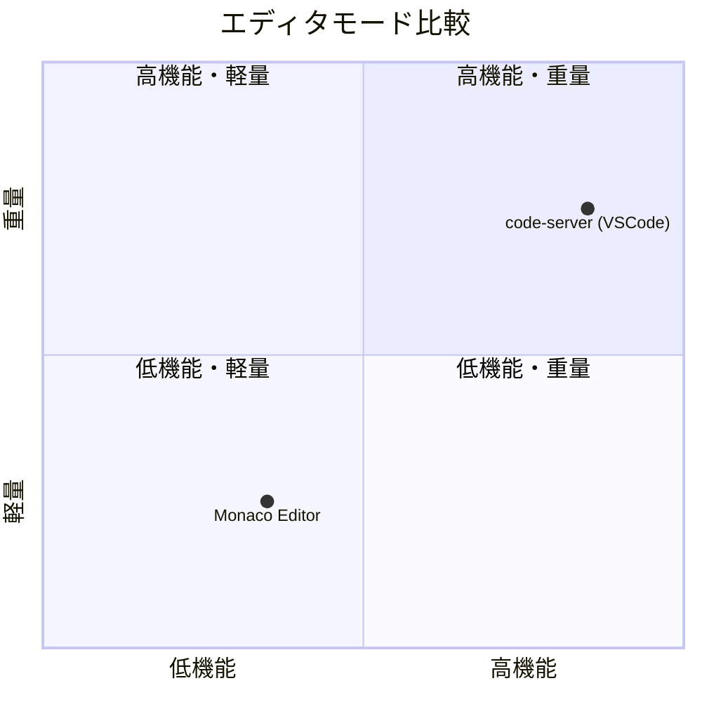

---

## 3. エディタモード設計

### 3.1 code-server モード（メイン）

#### 3.1.1 特徴

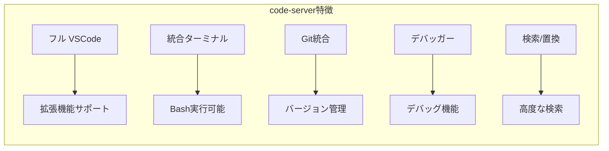

#### 3.1.2 統合方法

**iframe埋め込み:**

```typescript
// src/frontend/src/components/editor/CodeServerEditor.tsx
interface CodeServerEditorProps {
  workspacePath: string;
  projectId: string;
}

export const CodeServerEditor: React.FC<CodeServerEditorProps> = ({
  workspacePath,
  projectId
}) => {
  const codeServerUrl = process.env.NEXT_PUBLIC_CODE_SERVER_URL || 'http://localhost:8080';
  const editorUrl = `${codeServerUrl}/?folder=/home/coder/workspace/${projectId}`;

  return (
    <iframe
      src={editorUrl}
      className="w-full h-full border-0"
      sandbox="allow-scripts allow-same-origin allow-forms allow-modals allow-popups"
      allow="clipboard-read; clipboard-write"
    />
  );
};
```

#### 3.1.3 ワークスペース共有

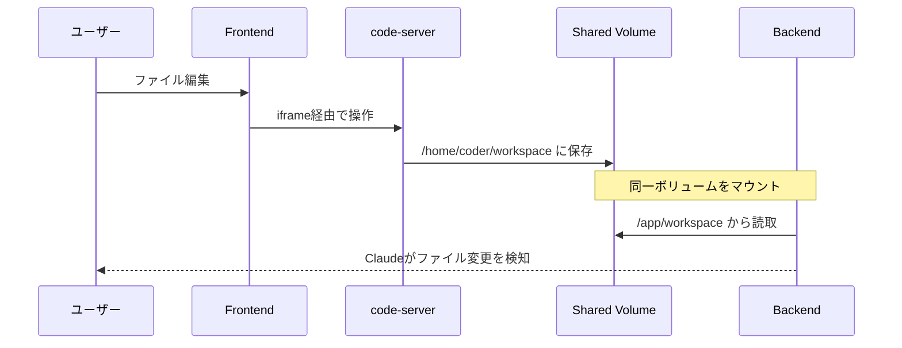

### 3.2 Monaco Editor モード（フォールバック）

#### 3.2.1 特徴

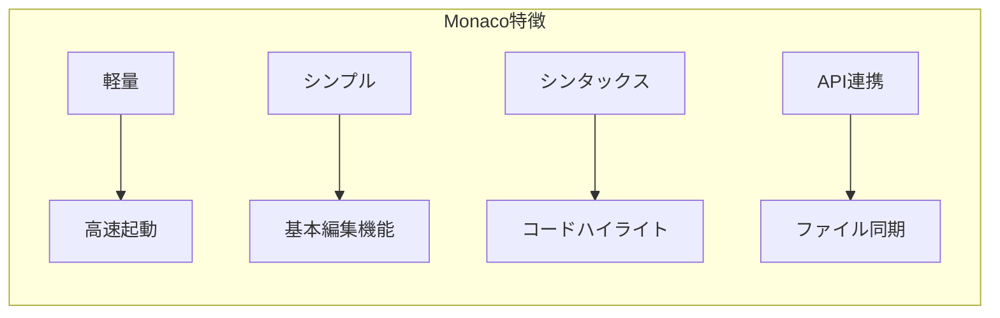

#### 3.2.2 実装

```typescript
// src/frontend/src/components/editor/MonacoEditor.tsx
import * as monaco from 'monaco-editor';

export const MonacoEditor: React.FC<MonacoEditorProps> = ({ filePath, projectId }) => {
  const editorRef = useRef<monaco.editor.IStandaloneCodeEditor>();
  const { content, updateFile } = useFileContent(projectId, filePath);

  useEffect(() => {
    const editor = monaco.editor.create(containerRef.current!, {
      value: content,
      language: getLanguageFromPath(filePath),
      theme: 'vs-dark',
      automaticLayout: true,
    });

    editor.onDidChangeModelContent(() => {
      const newContent = editor.getValue();
      updateFile(filePath, newContent);
    });

    editorRef.current = editor;
    return () => editor.dispose();
  }, [filePath]);

  return <div ref={containerRef} className="h-full w-full" />;
};
```

---

## 4. ファイル同期設計

### 4.1 ファイル同期フロー

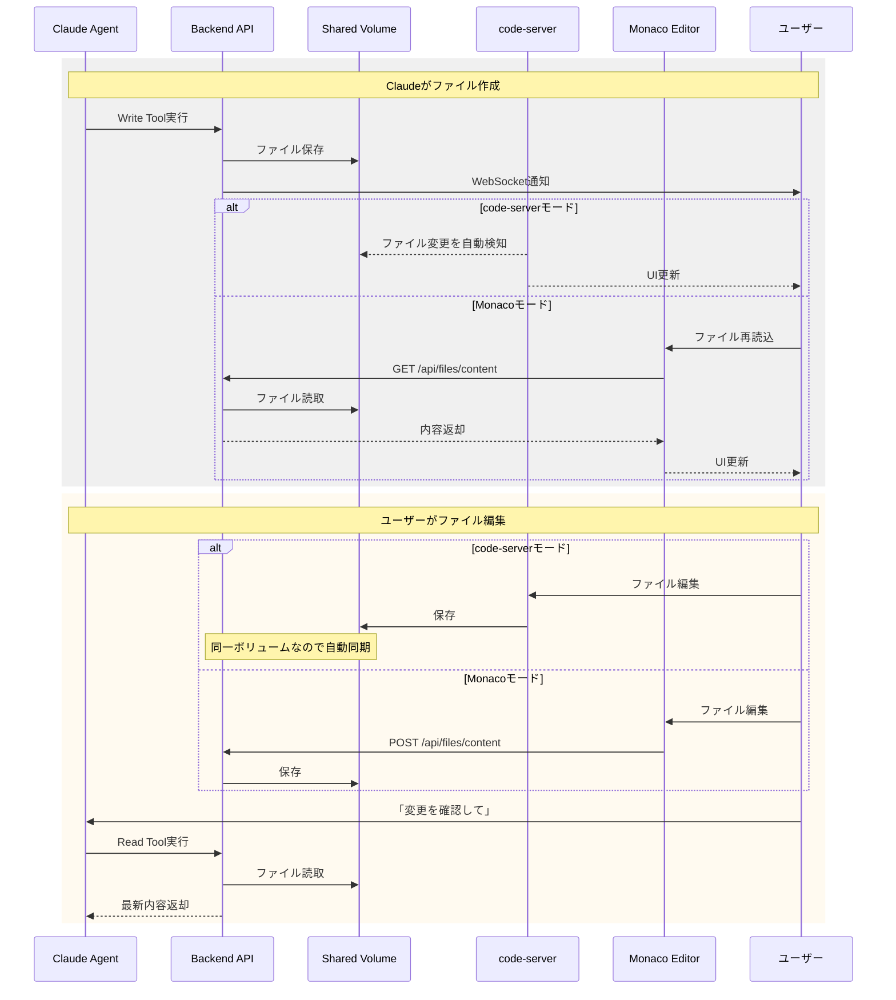

### 4.2 リアルタイム通知

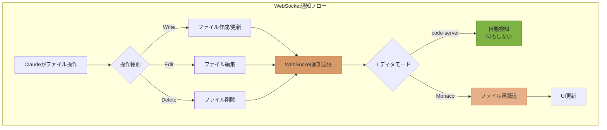

### 4.3 WebSocketメッセージ定義

```typescript
// ファイル変更通知
interface FileChangeNotification {
  type: 'file_change';
  operation: 'create' | 'update' | 'delete';
  path: string;
  project_id: string;
  content?: string; // update時のみ
}

// クライアント処理
wsClient.on('message', (msg: FileChangeNotification) => {
  if (msg.type === 'file_change' && editorMode === 'monaco') {
    fileStore.handleFileChange(msg);
  }
  // code-serverモードは自動検知するので処理不要
});
```

---

## 5. 実装タスク

### 5.1 タスク一覧

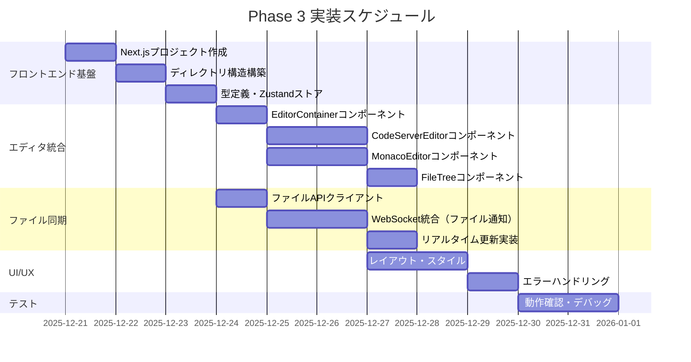

### 5.2 優先順位

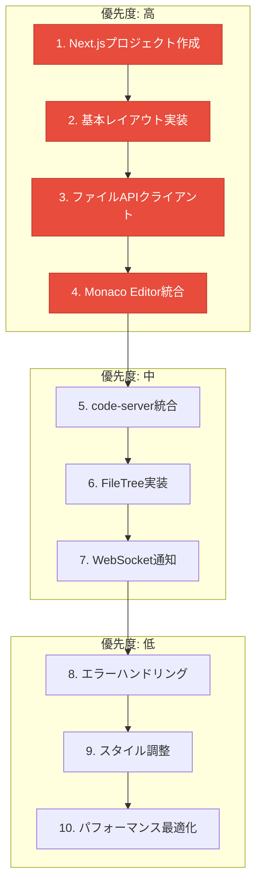

---

## 6. 技術仕様

### 6.1 フロントエンド技術スタック

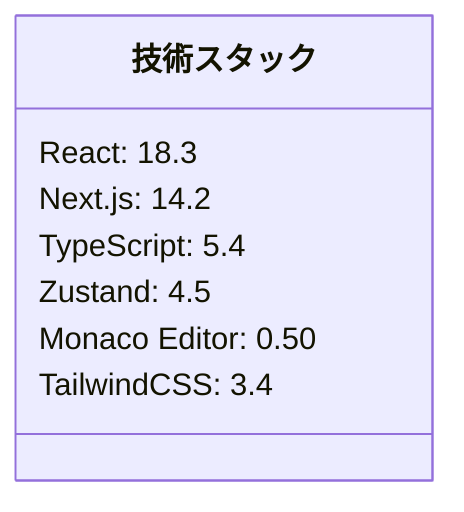

### 6.2 API エンドポイント

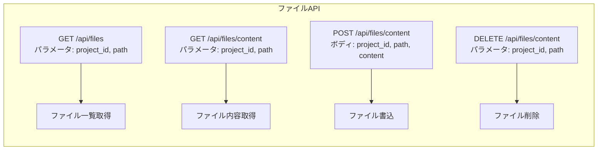

### 6.3 環境変数

```bash
# .env.local
NEXT_PUBLIC_API_URL=http://localhost:8000
NEXT_PUBLIC_WS_URL=ws://localhost:8000
NEXT_PUBLIC_CODE_SERVER_URL=http://localhost:8080
```

### 6.4 ディレクトリ構造

```
src/frontend/
├── src/
│   ├── app/
│   │   ├── layout.tsx
│   │   ├── page.tsx
│   │   └── globals.css
│   ├── components/
│   │   ├── editor/
│   │   │   ├── EditorContainer.tsx       # エディタモード切替
│   │   │   ├── CodeServerEditor.tsx      # code-server iframe
│   │   │   ├── MonacoEditor.tsx          # Monaco Editor
│   │   │   ├── FileTree.tsx              # ファイルツリー
│   │   │   └── FileTreeItem.tsx          # ツリーアイテム
│   │   ├── chat/
│   │   │   ├── ChatContainer.tsx
│   │   │   ├── MessageList.tsx
│   │   │   └── MessageInput.tsx
│   │   ├── layout/
│   │   │   ├── MainLayout.tsx            # 3カラムレイアウト
│   │   │   ├── Header.tsx
│   │   │   └── ResizablePanel.tsx
│   │   └── common/
│   │       ├── Button.tsx
│   │       ├── Loading.tsx
│   │       └── ErrorBoundary.tsx
│   ├── hooks/
│   │   ├── useWebSocket.ts               # WebSocket接続
│   │   ├── useFiles.ts                   # ファイル操作
│   │   └── useEditor.ts                  # エディタ状態
│   ├── stores/
│   │   ├── editorStore.ts                # エディタ状態管理
│   │   ├── fileStore.ts                  # ファイル状態管理
│   │   └── chatStore.ts                  # チャット状態管理
│   ├── lib/
│   │   └── api/
│   │       ├── client.ts                 # Axiosクライアント
│   │       └── files.ts                  # ファイルAPI
│   └── types/
│       ├── file.ts
│       ├── editor.ts
│       └── index.ts
├── public/
│   └── icons/
├── package.json
├── tsconfig.json
├── next.config.js
├── tailwind.config.ts
├── postcss.config.js
└── Dockerfile
```

---

## 7. 実装優先順位

### 7.1 Phase 3-1: フロントエンド基盤（1-2日）

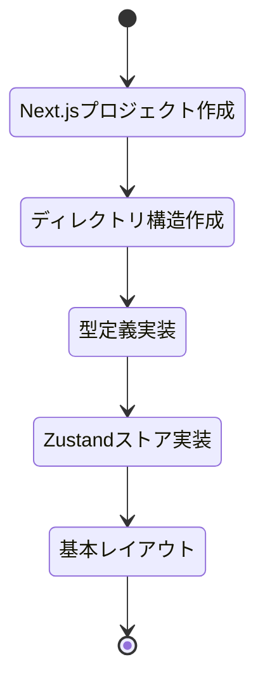

**タスク:**
1. `npx create-next-app@latest frontend` 実行
2. ディレクトリ構造作成
3. TypeScript型定義（file.ts, editor.ts）
4. Zustandストア（editorStore, fileStore）
5. MainLayoutコンポーネント

### 7.2 Phase 3-2: Monaco Editor統合（2-3日）

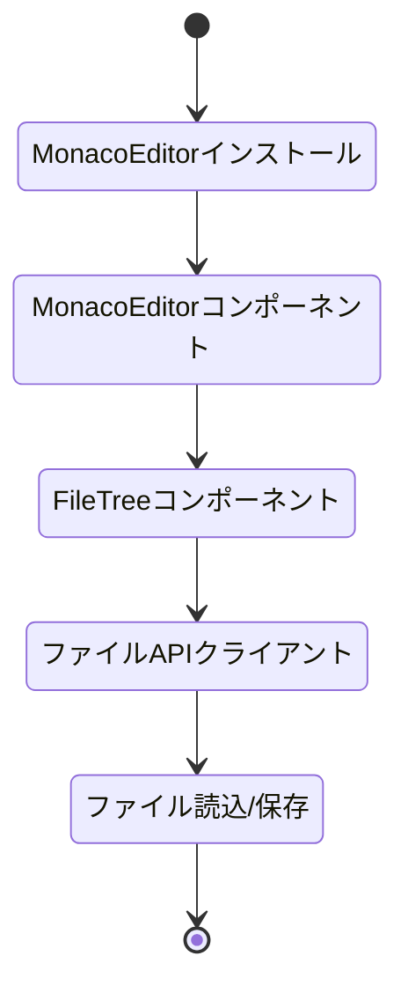

**タスク:**
1. `@monaco-editor/react` インストール
2. MonacoEditor.tsx実装
3. FileTree.tsx実装
4. API Client実装（Axios）
5. ファイル操作統合

### 7.3 Phase 3-3: code-server統合（1-2日）

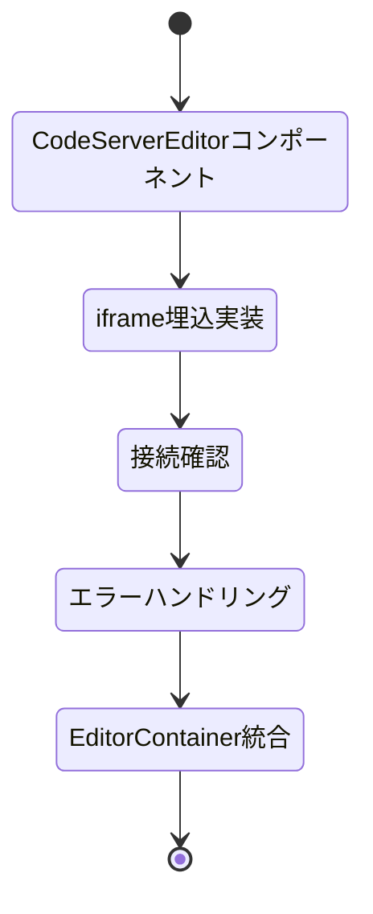

**タスク:**
1. CodeServerEditor.tsx実装
2. iframe埋め込み
3. ヘルスチェック実装
4. エラー表示UI
5. EditorContainer.tsxでモード切替

### 7.4 Phase 3-4: WebSocket統合（1日）

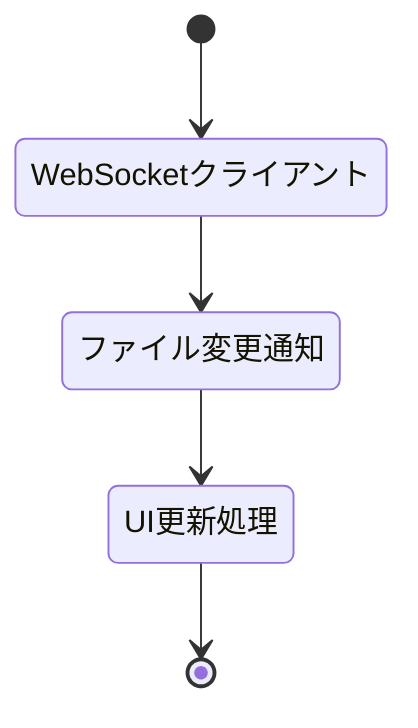

**タスク:**
1. useWebSocket.ts拡張（ファイル通知対応）
2. fileStore更新処理
3. Monaco Editorリロード実装

### 7.5 Phase 3-5: UI/UXポリッシュ（1-2日）

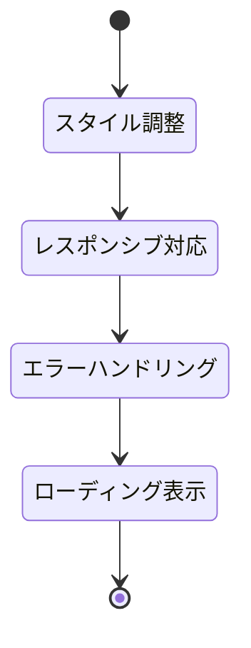

**タスク:**
1. TailwindCSSスタイル適用
2. レスポンシブデザイン
3. エラーバウンダリ
4. ローディングスピナー
5. 動作確認・デバッグ

---

## 8. 完成基準

### 8.1 機能要件

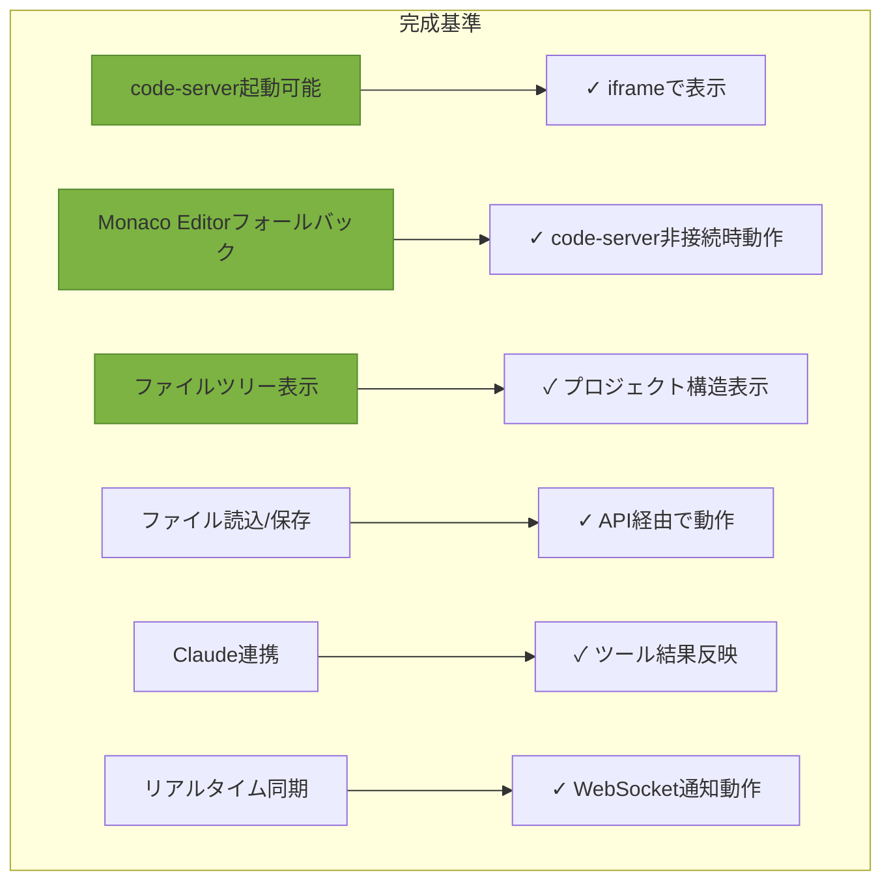

### 8.2 非機能要件

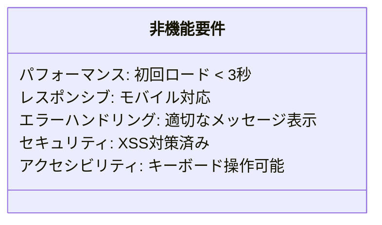

---

## 9. リスクと対策

### 9.1 リスク分析

```mermaid
quadrantChart
    title リスク分析マトリクス
    x-axis 低影響 --> 高影響
    y-axis 低確率 --> 高確率
    quadrant-1 高確率・高影響
    quadrant-2 高確率・低影響
    quadrant-3 低確率・低影響
    quadrant-4 低確率・高影響

    "code-server接続失敗": [0.75, 0.55]
    "ファイル同期ずれ": [0.65, 0.35]
    "パフォーマンス劣化": [0.45, 0.25]
    "CORS問題": [0.35, 0.65]
```

### 9.2 対策

```mermaid
flowchart LR
    subgraph リスク対策
        R1[code-server接続失敗] --> S1[Monaco自動切替]
        R2[ファイル同期ずれ] --> S2[手動リフレッシュボタン]
        R3[CORS問題] --> S3[プロキシ設定追加]
        R4[パフォーマンス劣化] --> S4[仮想スクロール実装]
    end

    style S1 fill:#7CB342,stroke:#558B2F
    style S2 fill:#7CB342,stroke:#558B2F
    style S3 fill:#7CB342,stroke:#558B2F
    style S4 fill:#7CB342,stroke:#558B2F
```

---

## 10. テスト計画

### 10.1 テストケース

```mermaid
flowchart TD
    subgraph テストシナリオ
        T1[code-server起動テスト]
        T2[Monaco起動テスト]
        T3[ファイル作成テスト]
        T4[ファイル編集テスト]
        T5[ファイル削除テスト]
        T6[リアルタイム同期テスト]
        T7[エラーハンドリングテスト]
    end

    T1 --> T2 --> T3 --> T4 --> T5 --> T6 --> T7
```

### 10.2 検証項目

```mermaid
classDiagram
    class 検証項目 {
        機能: 全機能動作確認
        パフォーマンス: ロード時間測定
        UI/UX: ユーザビリティ確認
        互換性: ブラウザ互換性
        セキュリティ: 脆弱性スキャン
    }
```

---

## 11. 次のステップ

```mermaid
flowchart LR
    subgraph 次のステップ
        N1[Phase 3完了] --> N2[Phase 4: チャット統合]
        N2 --> N3[Phase 5: 認証・権限]
        N3 --> N4[Phase 6: デプロイ]
    end

    style N1 fill:#D89968,stroke:#C17942
```

---

## 変更履歴

```mermaid
flowchart LR
    subgraph 変更履歴
        V10["v1.0 (2025-12-21)"] --> V10D["初版作成<br/>Phase 3設計完了"]
    end
```

---

**ドキュメント管理情報**

```mermaid
classDiagram
    class ドキュメント情報 {
        設計書バージョン: 1.0
        最終更新: 2025-12-21
        作成者: Claude Code
        レビューステータス: 🚧 レビュー待ち
        完成度: 100%
    }
```

**関連ドキュメント:**
- architecture-design.md
- frontend-design.md
- docker-design.md
- backend-design.md
