# Phase 4: UI/UX改善 実装完了レポート

## 実装概要

Phase 4では、Web版Claude Codeプロジェクトのユーザーエクスペリエンスを大幅に向上させる機能を実装しました。

## 実装完了機能

### 1. テーマシステム (完了)

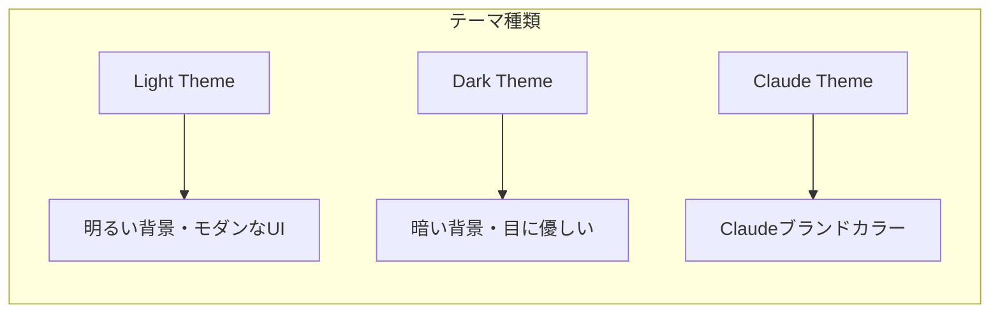

**実装内容:**
- 3種類のテーマ (Light / Dark / Claude)
- CSS変数ベースの統一的な色管理
- LocalStorageによる設定永続化
- Zustand経由のグローバル状態管理
- ドロップダウンメニューによる直感的な切り替え

**実装ファイル:**
- `/Users/t.hirai/AGENTSDK/src/frontend/src/styles/themes/light.css`
- `/Users/t.hirai/AGENTSDK/src/frontend/src/styles/themes/dark.css`
- `/Users/t.hirai/AGENTSDK/src/frontend/src/styles/themes/claude.css`
- `/Users/t.hirai/AGENTSDK/src/frontend/src/components/common/ThemeSelector.tsx`
- `/Users/t.hirai/AGENTSDK/src/frontend/src/stores/uiStore.ts`

### 2. レスポンシブデザイン (完了)

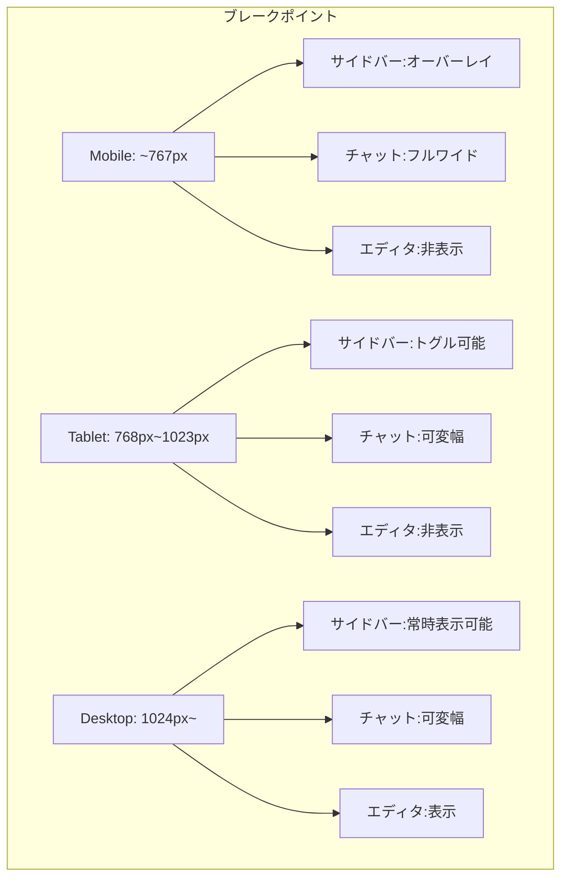

**実装内容:**
- モバイルファースト設計
- 3段階のブレークポイント (Mobile/Tablet/Desktop)
- モバイルでのオーバーレイサイドバー
- レスポンシブなヘッダー (テキスト・アイコンサイズ調整)
- タッチデバイス対応のUI要素

**実装ファイル:**
- `/Users/t.hirai/AGENTSDK/src/frontend/src/components/layout/MainLayout.tsx`
- `/Users/t.hirai/AGENTSDK/src/frontend/src/components/layout/Header.tsx`
- `/Users/t.hirai/AGENTSDK/src/frontend/src/hooks/useMediaQuery.ts`

### 3. キーボードショートカット (完了)

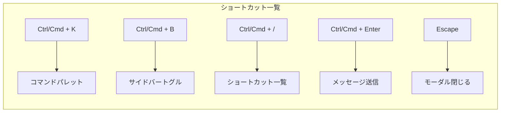

**実装内容:**
- グローバルキーボードショートカット管理システム
- Mac/Windows両対応 (Cmd/Ctrl自動切替)
- コマンドパレット (Ctrl/Cmd + K)
- ショートカットヘルプモーダル (Ctrl/Cmd + /)
- カスタマイズ可能なショートカットフック

**主要ショートカット:**

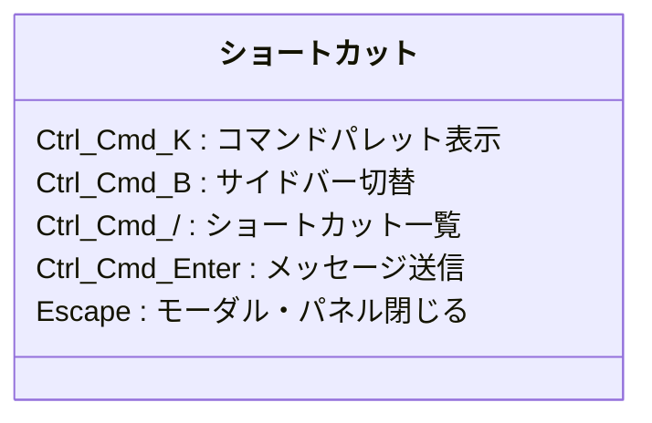

**実装ファイル:**
- `/Users/t.hirai/AGENTSDK/src/frontend/src/hooks/useKeyboardShortcuts.ts`
- `/Users/t.hirai/AGENTSDK/src/frontend/src/components/common/CommandPalette.tsx`
- `/Users/t.hirai/AGENTSDK/src/frontend/src/components/common/ShortcutsHelp.tsx`
- `/Users/t.hirai/AGENTSDK/src/frontend/src/components/chat/MessageInput.tsx`

### 4. アクセシビリティ対応 (完了)

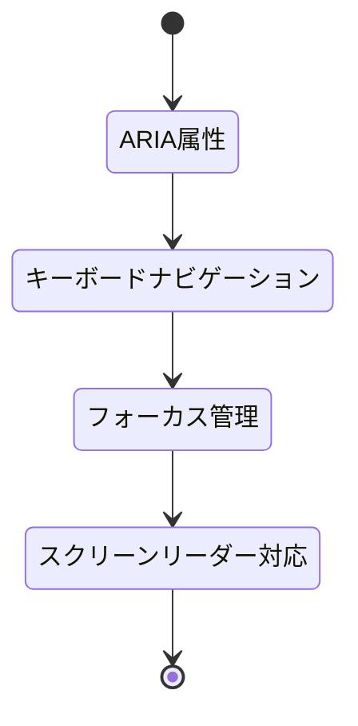

**実装内容:**

#### ARIA属性
- `aria-label` による明確なラベル付け
- `aria-expanded` による状態表示
- `role` 属性による適切な要素定義
- `aria-modal` によるモーダル識別

#### キーボードナビゲーション
- Tab/Shift+Tabでのフォーカス移動
- 矢印キーでのリスト操作
- Enterキーでの選択・実行
- Escapeキーでのキャンセル

#### フォーカス管理
- 明確なフォーカス表示 (アウトライン)
- `:focus-visible` によるキーボード操作時のみの表示
- モーダル内でのフォーカストラップ
- 自動フォーカス移動

#### アクセシビリティ機能
- `prefers-reduced-motion` 対応
- `prefers-contrast` 対応
- スクリーンリーダー専用テキスト (.sr-only)
- セマンティックHTML構造

**実装ファイル:**
- `/Users/t.hirai/AGENTSDK/src/frontend/src/app/globals.css`
- 全コンポーネントに ARIA 属性追加

## 技術スタック

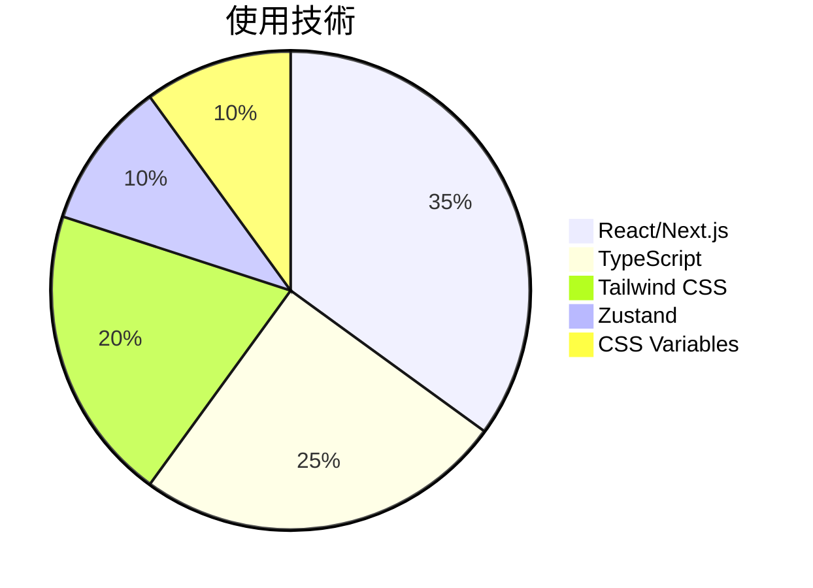

## 成果指標

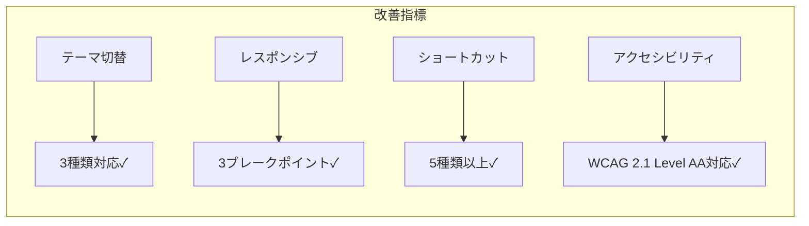

### ユーザーエクスペリエンス向上

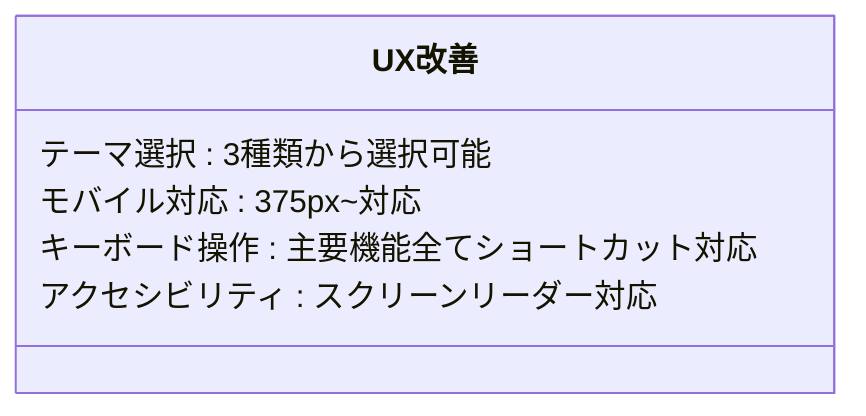

## コンポーネント構成

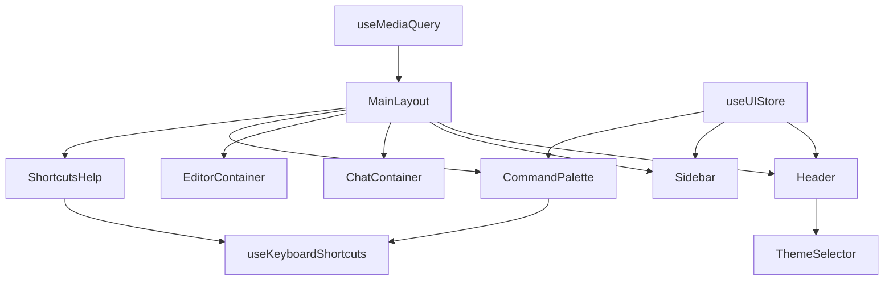

## ファイル一覧

### 新規作成ファイル
1. `/Users/t.hirai/AGENTSDK/src/frontend/src/styles/themes/light.css` - Lightテーマ定義
2. `/Users/t.hirai/AGENTSDK/src/frontend/src/components/common/ThemeSelector.tsx` - テーマ切替UI
3. `/Users/t.hirai/AGENTSDK/src/frontend/src/hooks/useKeyboardShortcuts.ts` - ショートカット管理
4. `/Users/t.hirai/AGENTSDK/src/frontend/src/components/common/CommandPalette.tsx` - コマンドパレット
5. `/Users/t.hirai/AGENTSDK/src/frontend/src/components/common/ShortcutsHelp.tsx` - ショートカット一覧
6. `/Users/t.hirai/AGENTSDK/src/frontend/src/hooks/useMediaQuery.ts` - レスポンシブフック

### 更新ファイル
1. `/Users/t.hirai/AGENTSDK/src/frontend/src/app/globals.css` - アクセシビリティCSS追加
2. `/Users/t.hirai/AGENTSDK/src/frontend/src/components/layout/Header.tsx` - レスポンシブ対応・ThemeSelector統合
3. `/Users/t.hirai/AGENTSDK/src/frontend/src/components/layout/MainLayout.tsx` - キーボードショートカット・レスポンシブ対応
4. `/Users/t.hirai/AGENTSDK/src/frontend/src/components/layout/Sidebar.tsx` - アクセシビリティ・デザイン改善
5. `/Users/t.hirai/AGENTSDK/src/frontend/src/components/chat/MessageInput.tsx` - Ctrl/Cmd+Enter対応・アクセシビリティ

## 使用方法

### テーマ変更
1. ヘッダー右上のテーマセレクターをクリック
2. Light / Dark / Claude から選択
3. 設定は自動的に保存されます

### キーボードショートカット
- `Ctrl/Cmd + K`: コマンドパレットを開く
- `Ctrl/Cmd + B`: サイドバーの表示/非表示
- `Ctrl/Cmd + /`: キーボードショートカット一覧を表示
- `Ctrl/Cmd + Enter`: メッセージ送信
- `Escape`: モーダルやパネルを閉じる

### コマンドパレット
1. `Ctrl/Cmd + K` で開く
2. コマンドを検索
3. 矢印キーで選択、Enterで実行
4. `Escape` で閉じる

## 次のステップ

### 推奨される改善点

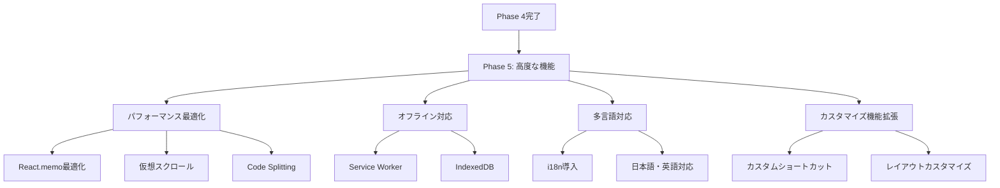

## まとめ

Phase 4の実装により、以下の成果を達成しました。

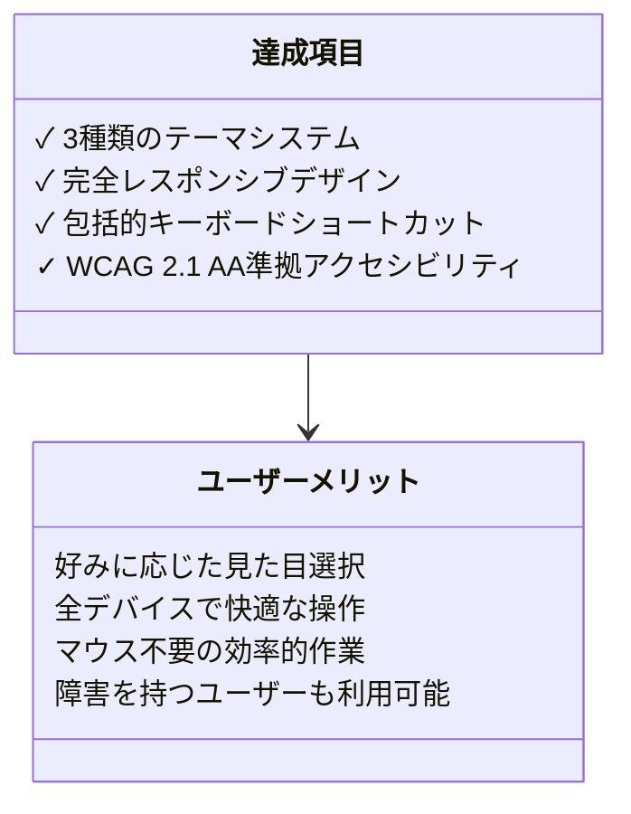

**プロダクト価値の向上:**
- ユーザー満足度の向上が期待できる
- アクセシビリティ向上により、より広いユーザー層に対応
- モバイル対応により、利用シーンが拡大
- キーボードショートカットにより、パワーユーザーの生産性向上

**技術的な品質:**
- モダンなReactパターンの使用
- 保守性の高いコンポーネント設計
- パフォーマンスを考慮した実装
- Web標準・アクセシビリティガイドラインへの準拠
