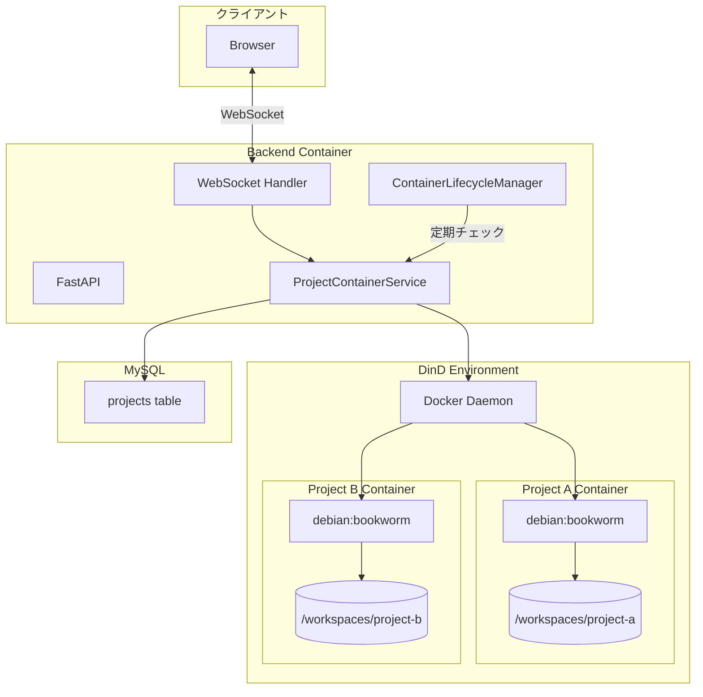
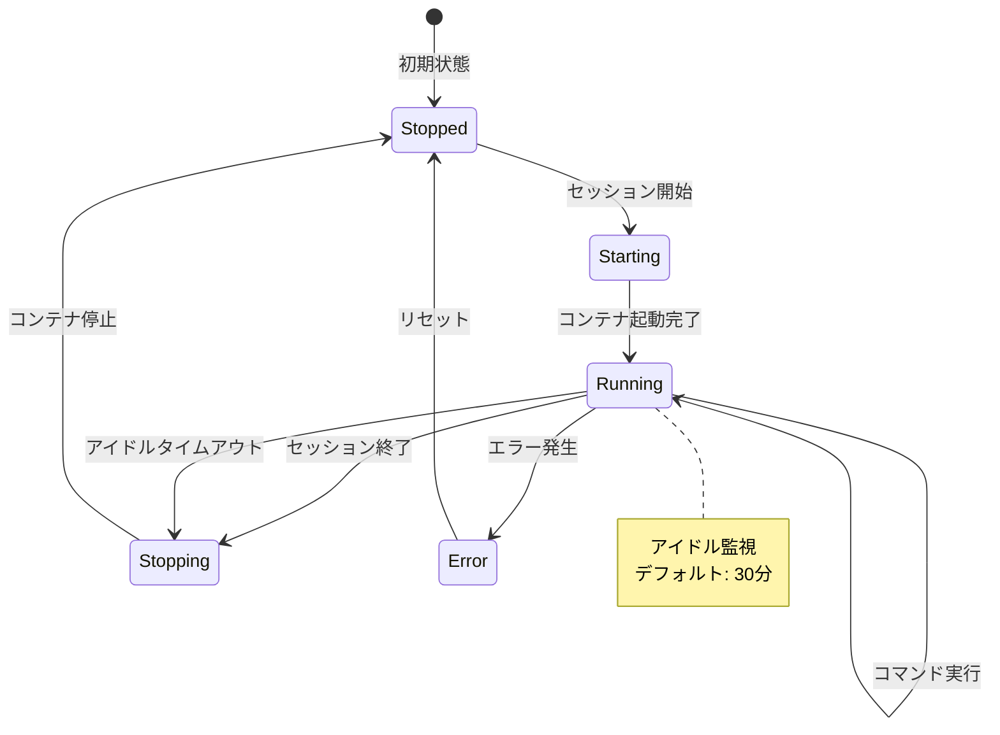
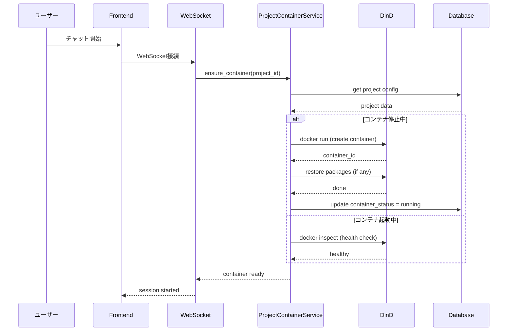
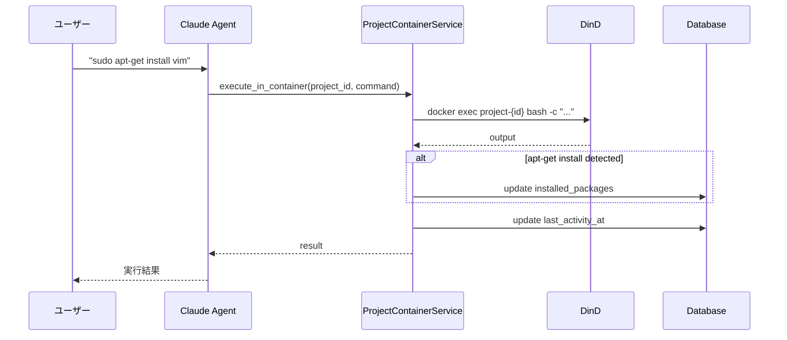
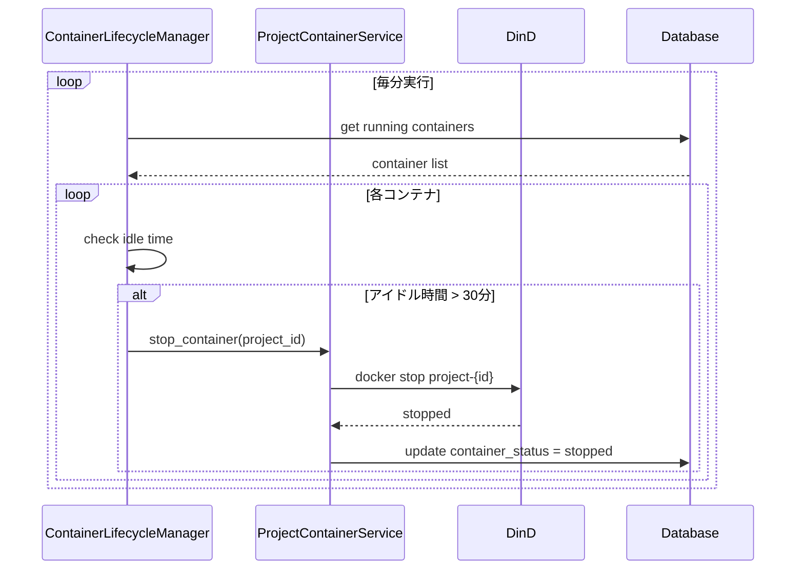
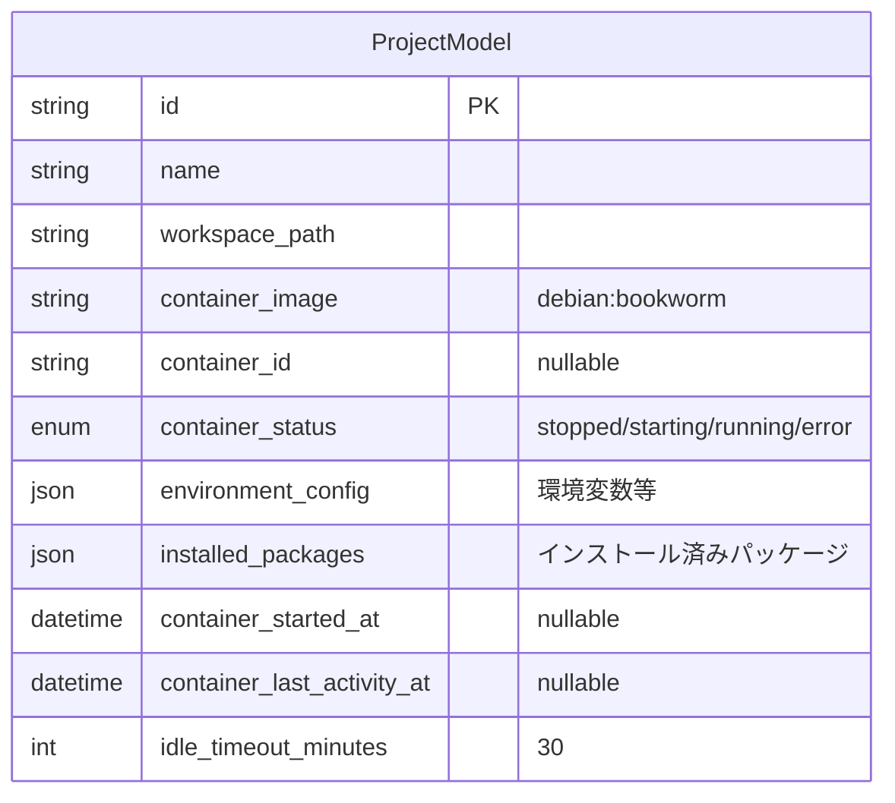
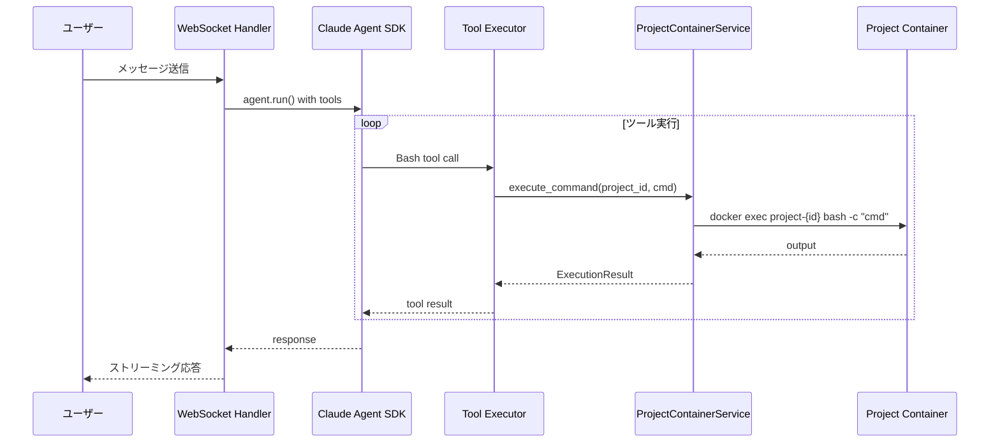
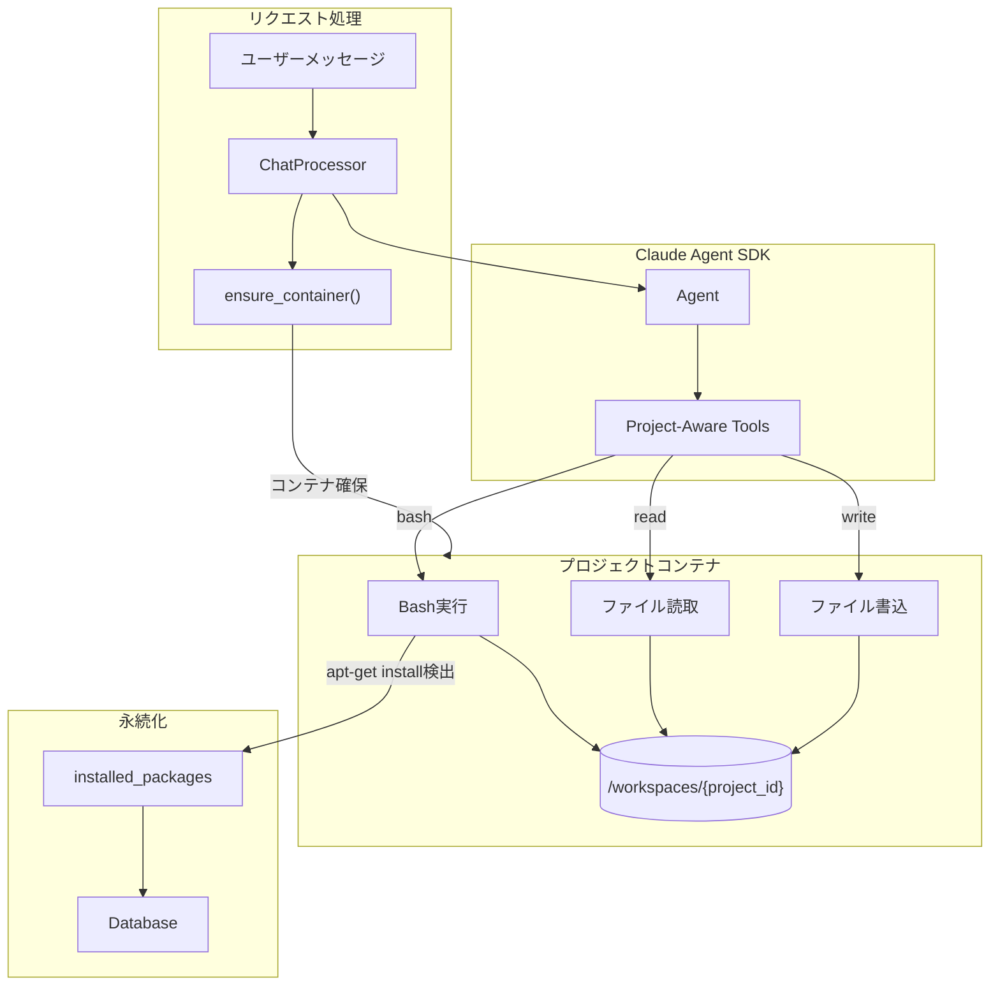
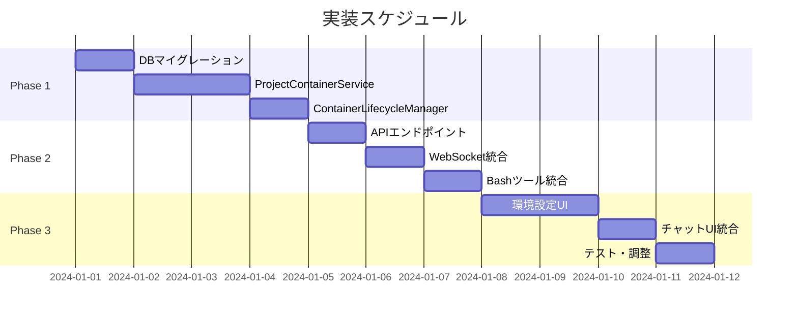

# プロジェクト別分離環境 設計書

## 1. 概要

### 1.1 目的

プロジェクトごとに独立したDockerコンテナ環境を提供し、パッケージのインストールや設定変更が他のプロジェクトに影響しないようにする。

### 1.2 要件

| 要件 | 内容 |
|------|------|
| 分離レベル | システムパッケージ（apt-get）を含む完全分離 |
| ベースイメージ | debian:bookworm |
| ライフサイクル | セッション終了時停止 + アイドル時自動停止 |
| 永続化 | インストール済みパッケージの記録・復元 |

### 1.3 採用方式

**DinDコンテナ方式** - 既存のDocker-in-Docker環境を活用し、プロジェクトごとに専用コンテナを起動・管理する。

---

## 2. アーキテクチャ

### 2.1 全体構成



### 2.2 コンテナライフサイクル



### 2.3 シーケンス図

#### セッション開始時



#### コマンド実行時



#### セッション終了・自動停止



---

## 3. データモデル

### 3.1 ProjectModel 拡張



### 3.2 追加カラム詳細

| カラム | 型 | デフォルト | 説明 |
|--------|-----|-----------|------|
| `container_image` | VARCHAR(200) | `debian:bookworm` | ベースDockerイメージ |
| `container_id` | VARCHAR(64) | NULL | 実行中コンテナのID |
| `container_status` | ENUM | `stopped` | コンテナ状態 |
| `environment_config` | JSON | `{}` | 追加環境変数 |
| `installed_packages` | JSON | `[]` | apt-getでインストールしたパッケージ |
| `container_started_at` | DATETIME | NULL | コンテナ起動時刻 |
| `container_last_activity_at` | DATETIME | NULL | 最終アクティビティ時刻 |
| `idle_timeout_minutes` | INT | `30` | アイドルタイムアウト（分） |

### 3.3 マイグレーションSQL

```sql
ALTER TABLE projects
ADD COLUMN container_image VARCHAR(200) DEFAULT 'debian:bookworm',
ADD COLUMN container_id VARCHAR(64) NULL,
ADD COLUMN container_status ENUM('stopped', 'starting', 'running', 'error') DEFAULT 'stopped',
ADD COLUMN environment_config JSON DEFAULT '{}',
ADD COLUMN installed_packages JSON DEFAULT '[]',
ADD COLUMN container_started_at DATETIME NULL,
ADD COLUMN container_last_activity_at DATETIME NULL,
ADD COLUMN idle_timeout_minutes INT DEFAULT 30;

CREATE INDEX ix_projects_container_status ON projects(container_status);
```

---

## 4. コンポーネント設計

### 4.1 ProjectContainerService

```python
# app/services/project_container_service.py

from dataclasses import dataclass
from datetime import datetime
from typing import Optional, List
import subprocess
import logging

logger = logging.getLogger(__name__)

@dataclass
class ContainerInfo:
    container_id: str
    container_name: str
    status: str
    started_at: Optional[datetime]
    image: str

@dataclass
class ExecutionResult:
    returncode: int
    stdout: str
    stderr: str
    duration_ms: int

class ProjectContainerService:
    """プロジェクト専用コンテナの管理サービス"""

    CONTAINER_PREFIX = "claude-project-"
    NETWORK_NAME = "claude-network"
    WORKSPACE_BASE = "/workspaces"

    def __init__(self, docker_host: str = "tcp://dind:2375"):
        self.docker_host = docker_host
        self.docker_env = {"DOCKER_HOST": docker_host}

    # ========================================
    # コンテナ管理
    # ========================================

    async def ensure_container(self, project: ProjectModel) -> ContainerInfo:
        """
        プロジェクト用コンテナを確保（なければ作成）

        Args:
            project: プロジェクトモデル

        Returns:
            ContainerInfo: コンテナ情報
        """
        container_name = self._get_container_name(project.id)

        # 既存コンテナの確認
        existing = await self._inspect_container(container_name)
        if existing and existing.status == "running":
            return existing

        # 停止中コンテナがあれば起動
        if existing and existing.status == "exited":
            await self._start_container(container_name)
            return await self._inspect_container(container_name)

        # 新規コンテナ作成
        return await self._create_container(project)

    async def _create_container(self, project: ProjectModel) -> ContainerInfo:
        """新規コンテナを作成"""
        container_name = self._get_container_name(project.id)
        workspace_path = f"{self.WORKSPACE_BASE}/{project.id}"
        image = project.container_image or "debian:bookworm"

        cmd = [
            "docker", "run", "-d",
            "--name", container_name,
            "--hostname", f"project-{project.id[:8]}",
            "-v", f"{workspace_path}:{workspace_path}",
            "-w", workspace_path,
            "--network", self.NETWORK_NAME,
            "--restart", "no",
            # リソース制限
            "--memory", "2g",
            "--cpus", "1.0",
            # セキュリティ
            "--security-opt", "no-new-privileges",
        ]

        # 環境変数追加
        env_config = project.environment_config or {}
        for key, value in env_config.items():
            cmd.extend(["-e", f"{key}={value}"])

        cmd.extend([
            image,
            "tail", "-f", "/dev/null"  # コンテナを起動状態に保つ
        ])

        result = subprocess.run(cmd, env=self.docker_env, capture_output=True, text=True)

        if result.returncode != 0:
            raise RuntimeError(f"Failed to create container: {result.stderr}")

        container_id = result.stdout.strip()

        # パッケージ復元
        if project.installed_packages:
            await self._restore_packages(container_name, project.installed_packages)

        return ContainerInfo(
            container_id=container_id,
            container_name=container_name,
            status="running",
            started_at=datetime.utcnow(),
            image=image
        )

    async def stop_container(self, project_id: str) -> bool:
        """コンテナを停止"""
        container_name = self._get_container_name(project_id)

        result = subprocess.run(
            ["docker", "stop", "-t", "10", container_name],
            env=self.docker_env,
            capture_output=True
        )

        return result.returncode == 0

    async def remove_container(self, project_id: str) -> bool:
        """コンテナを削除"""
        container_name = self._get_container_name(project_id)

        # 停止
        await self.stop_container(project_id)

        # 削除
        result = subprocess.run(
            ["docker", "rm", "-f", container_name],
            env=self.docker_env,
            capture_output=True
        )

        return result.returncode == 0

    # ========================================
    # コマンド実行
    # ========================================

    async def execute_command(
        self,
        project_id: str,
        command: str,
        timeout: int = 300,
        user: str = "root"
    ) -> ExecutionResult:
        """
        プロジェクトコンテナ内でコマンドを実行

        Args:
            project_id: プロジェクトID
            command: 実行するコマンド
            timeout: タイムアウト秒数
            user: 実行ユーザー

        Returns:
            ExecutionResult: 実行結果
        """
        container_name = self._get_container_name(project_id)
        start_time = datetime.utcnow()

        result = subprocess.run(
            ["docker", "exec", "-u", user, container_name, "/bin/bash", "-c", command],
            env=self.docker_env,
            capture_output=True,
            text=True,
            timeout=timeout
        )

        duration_ms = int((datetime.utcnow() - start_time).total_seconds() * 1000)

        return ExecutionResult(
            returncode=result.returncode,
            stdout=result.stdout,
            stderr=result.stderr,
            duration_ms=duration_ms
        )

    # ========================================
    # パッケージ管理
    # ========================================

    async def install_packages(
        self,
        project_id: str,
        packages: List[str]
    ) -> ExecutionResult:
        """
        パッケージをインストール

        Args:
            project_id: プロジェクトID
            packages: インストールするパッケージのリスト

        Returns:
            ExecutionResult: 実行結果
        """
        if not packages:
            return ExecutionResult(0, "", "", 0)

        # apt-get update & install
        package_str = " ".join(packages)
        command = f"apt-get update && apt-get install -y {package_str}"

        return await self.execute_command(project_id, command, timeout=600)

    async def _restore_packages(self, container_name: str, packages: List[str]) -> None:
        """保存済みパッケージを復元"""
        if not packages:
            return

        package_str = " ".join(packages)
        command = f"apt-get update && apt-get install -y {package_str}"

        subprocess.run(
            ["docker", "exec", container_name, "/bin/bash", "-c", command],
            env=self.docker_env,
            capture_output=True,
            timeout=600
        )

    def parse_installed_packages(self, command: str) -> List[str]:
        """
        apt-get installコマンドからパッケージ名を抽出

        Args:
            command: 実行されたコマンド

        Returns:
            List[str]: パッケージ名のリスト
        """
        import re

        # apt-get install / apt install パターン
        patterns = [
            r"apt-get\s+install\s+(?:-y\s+)?(.+)",
            r"apt\s+install\s+(?:-y\s+)?(.+)",
        ]

        for pattern in patterns:
            match = re.search(pattern, command)
            if match:
                packages_str = match.group(1)
                # オプションを除外してパッケージ名のみ抽出
                packages = [
                    p for p in packages_str.split()
                    if not p.startswith("-") and p not in ["&&", ";", "|"]
                ]
                return packages

        return []

    # ========================================
    # ユーティリティ
    # ========================================

    def _get_container_name(self, project_id: str) -> str:
        """コンテナ名を生成"""
        return f"{self.CONTAINER_PREFIX}{project_id}"

    async def _inspect_container(self, container_name: str) -> Optional[ContainerInfo]:
        """コンテナ情報を取得"""
        result = subprocess.run(
            ["docker", "inspect", "--format",
             '{"id":"{{.Id}}","status":"{{.State.Status}}","started":"{{.State.StartedAt}}"}',
             container_name],
            env=self.docker_env,
            capture_output=True,
            text=True
        )

        if result.returncode != 0:
            return None

        import json
        data = json.loads(result.stdout)

        return ContainerInfo(
            container_id=data["id"][:12],
            container_name=container_name,
            status=data["status"],
            started_at=datetime.fromisoformat(data["started"].replace("Z", "+00:00")) if data["started"] else None,
            image=""
        )

    async def _start_container(self, container_name: str) -> None:
        """停止中のコンテナを起動"""
        subprocess.run(
            ["docker", "start", container_name],
            env=self.docker_env,
            capture_output=True
        )
```

### 4.2 ContainerLifecycleManager

```python
# app/core/container_lifecycle_manager.py

from datetime import datetime, timedelta
from typing import List
import asyncio
import logging

logger = logging.getLogger(__name__)

class ContainerLifecycleManager:
    """コンテナのライフサイクル管理（自動停止等）"""

    DEFAULT_IDLE_TIMEOUT_MINUTES = 30
    CHECK_INTERVAL_SECONDS = 60

    def __init__(
        self,
        container_service: ProjectContainerService,
        db_session_factory
    ):
        self.container_service = container_service
        self.db_session_factory = db_session_factory
        self._running = False
        self._task: Optional[asyncio.Task] = None

    async def start(self) -> None:
        """ライフサイクル管理を開始"""
        self._running = True
        self._task = asyncio.create_task(self._monitor_loop())
        logger.info("ContainerLifecycleManager started")

    async def stop(self) -> None:
        """ライフサイクル管理を停止"""
        self._running = False
        if self._task:
            self._task.cancel()
            try:
                await self._task
            except asyncio.CancelledError:
                pass
        logger.info("ContainerLifecycleManager stopped")

    async def _monitor_loop(self) -> None:
        """定期監視ループ"""
        while self._running:
            try:
                await self._check_idle_containers()
            except Exception as e:
                logger.error(f"Error in container monitor: {e}")

            await asyncio.sleep(self.CHECK_INTERVAL_SECONDS)

    async def _check_idle_containers(self) -> None:
        """アイドルコンテナをチェックして停止"""
        async with self.db_session_factory() as session:
            # 実行中のコンテナを持つプロジェクトを取得
            result = await session.execute(
                select(ProjectModel).where(
                    ProjectModel.container_status == "running"
                )
            )
            projects = result.scalars().all()

            now = datetime.utcnow()

            for project in projects:
                idle_timeout = project.idle_timeout_minutes or self.DEFAULT_IDLE_TIMEOUT_MINUTES
                last_activity = project.container_last_activity_at or project.container_started_at

                if last_activity is None:
                    continue

                idle_duration = now - last_activity

                if idle_duration > timedelta(minutes=idle_timeout):
                    logger.info(
                        f"Stopping idle container for project {project.id} "
                        f"(idle for {idle_duration.total_seconds() / 60:.1f} minutes)"
                    )

                    # コンテナ停止
                    await self.container_service.stop_container(project.id)

                    # DB更新
                    project.container_status = "stopped"
                    project.container_id = None
                    await session.commit()

    async def on_session_end(self, project_id: str) -> None:
        """セッション終了時の処理"""
        async with self.db_session_factory() as session:
            result = await session.execute(
                select(ProjectModel).where(ProjectModel.id == project_id)
            )
            project = result.scalar_one_or_none()

            if project and project.container_status == "running":
                # アクティブなセッションがあるか確認
                active_sessions = await session.execute(
                    select(SessionModel).where(
                        SessionModel.project_id == project_id,
                        SessionModel.status.in_(["active", "processing"])
                    )
                )

                if not active_sessions.scalars().first():
                    # アクティブなセッションがなければ停止
                    logger.info(f"Stopping container for project {project_id} (session ended)")
                    await self.container_service.stop_container(project_id)

                    project.container_status = "stopped"
                    project.container_id = None
                    await session.commit()
```

### 4.3 WebSocket Handler 統合

```python
# app/api/websocket/handlers.py への追加

class ChatWebSocketHandler:
    def __init__(self, ...):
        # ... 既存コード ...
        self.container_service = ProjectContainerService()

    async def handle_message(self, websocket, project_id: str, message: dict):
        # コンテナを確保
        project = await self._get_project(project_id)
        container_info = await self.container_service.ensure_container(project)

        # container_status を更新
        await self._update_container_status(project_id, "running", container_info.container_id)

        # ... 既存の処理 ...

    async def execute_bash_tool(self, project_id: str, command: str) -> str:
        """Bashツールの実行をプロジェクトコンテナにルーティング"""

        # コマンド実行
        result = await self.container_service.execute_command(project_id, command)

        # アクティビティ時刻を更新
        await self._update_last_activity(project_id)

        # apt-get install を検出してパッケージを記録
        packages = self.container_service.parse_installed_packages(command)
        if packages and result.returncode == 0:
            await self._add_installed_packages(project_id, packages)

        if result.returncode == 0:
            return result.stdout
        else:
            return f"Error (exit code {result.returncode}):\n{result.stderr}"
```

### 4.4 Claude Agent SDK 統合

#### 概要

Claude Agent SDKのBashツール実行をプロジェクト専用コンテナにルーティングする。



#### ToolExecutorの実装

```python
# app/core/tool_executor.py

from claude_agent_sdk import Tool, ToolResult
from app.services.project_container_service import ProjectContainerService

class ProjectAwareBashTool(Tool):
    """プロジェクトコンテナ内でBashコマンドを実行するツール"""

    name = "bash"
    description = "Execute bash commands in the project's isolated container environment"

    def __init__(self, project_id: str, container_service: ProjectContainerService):
        self.project_id = project_id
        self.container_service = container_service

    async def execute(self, command: str, timeout: int = 300) -> ToolResult:
        """
        プロジェクトコンテナ内でコマンドを実行

        Args:
            command: 実行するBashコマンド
            timeout: タイムアウト秒数

        Returns:
            ToolResult: 実行結果
        """
        try:
            # プロジェクトコンテナ内で実行
            result = await self.container_service.execute_command(
                project_id=self.project_id,
                command=command,
                timeout=timeout
            )

            # apt-get install を検出してパッケージを記録
            packages = self.container_service.parse_installed_packages(command)
            if packages and result.returncode == 0:
                await self._record_installed_packages(packages)

            if result.returncode == 0:
                return ToolResult(
                    success=True,
                    output=result.stdout
                )
            else:
                return ToolResult(
                    success=False,
                    output=f"Exit code {result.returncode}\n{result.stderr}"
                )

        except TimeoutError:
            return ToolResult(
                success=False,
                output=f"Command timed out after {timeout} seconds"
            )
        except Exception as e:
            return ToolResult(
                success=False,
                output=f"Error executing command: {str(e)}"
            )

    async def _record_installed_packages(self, packages: list[str]) -> None:
        """インストールしたパッケージをDBに記録"""
        # DB更新ロジック
        pass


class ProjectAwareReadTool(Tool):
    """プロジェクトコンテナ内でファイルを読み取るツール"""

    name = "read"
    description = "Read file contents from the project's workspace"

    def __init__(self, project_id: str, container_service: ProjectContainerService):
        self.project_id = project_id
        self.container_service = container_service
        self.workspace_base = f"/workspaces/{project_id}"

    async def execute(self, file_path: str) -> ToolResult:
        """ファイルを読み取り"""
        # パス検証（ワークスペース外へのアクセス防止）
        normalized = self._normalize_path(file_path)
        if not normalized.startswith(self.workspace_base):
            return ToolResult(
                success=False,
                output="Access denied: path outside workspace"
            )

        result = await self.container_service.execute_command(
            project_id=self.project_id,
            command=f"cat {normalized}"
        )

        if result.returncode == 0:
            return ToolResult(success=True, output=result.stdout)
        else:
            return ToolResult(success=False, output=result.stderr)


class ProjectAwareWriteTool(Tool):
    """プロジェクトコンテナ内でファイルを書き込むツール"""

    name = "write"
    description = "Write content to a file in the project's workspace"

    def __init__(self, project_id: str, container_service: ProjectContainerService):
        self.project_id = project_id
        self.container_service = container_service
        self.workspace_base = f"/workspaces/{project_id}"

    async def execute(self, file_path: str, content: str) -> ToolResult:
        """ファイルを書き込み"""
        normalized = self._normalize_path(file_path)
        if not normalized.startswith(self.workspace_base):
            return ToolResult(
                success=False,
                output="Access denied: path outside workspace"
            )

        # ヒアドキュメントで書き込み
        escaped_content = content.replace("'", "'\\''")
        command = f"cat > {normalized} << 'EOF'\n{content}\nEOF"

        result = await self.container_service.execute_command(
            project_id=self.project_id,
            command=command
        )

        if result.returncode == 0:
            return ToolResult(success=True, output=f"Written to {file_path}")
        else:
            return ToolResult(success=False, output=result.stderr)
```

#### ChatProcessor統合

```python
# app/core/chat_processor.py

from claude_agent_sdk import Agent, AgentConfig
from app.core.tool_executor import (
    ProjectAwareBashTool,
    ProjectAwareReadTool,
    ProjectAwareWriteTool,
)
from app.services.project_container_service import ProjectContainerService

class ChatProcessor:
    """Claude Agent SDKを使用したチャット処理"""

    def __init__(self):
        self.container_service = ProjectContainerService()

    async def process_message(
        self,
        project_id: str,
        session_id: str,
        message: str,
        model: str = "claude-sonnet-4-20250514"
    ) -> AsyncIterator[dict]:
        """
        メッセージを処理し、レスポンスをストリーミング

        Args:
            project_id: プロジェクトID
            session_id: セッションID
            message: ユーザーメッセージ
            model: 使用するモデル

        Yields:
            dict: ストリーミングイベント
        """
        # プロジェクト情報取得
        project = await self._get_project(project_id)

        # プロジェクトコンテナを確保
        container_info = await self.container_service.ensure_container(project)
        await self._update_container_status(project_id, "running", container_info.container_id)

        # プロジェクト専用ツールを作成
        tools = self._create_project_tools(project_id)

        # Agent設定
        config = AgentConfig(
            model=model,
            tools=tools,
            system_prompt=self._build_system_prompt(project),
            # MCP servers, agents, skills などプロジェクト設定から取得
            mcp_servers=await self._get_mcp_servers(project_id),
        )

        # Agentを作成・実行
        agent = Agent(config)

        async for event in agent.run(message, session_id=session_id):
            # アクティビティ時刻を更新
            await self._update_last_activity(project_id)

            yield event

    def _create_project_tools(self, project_id: str) -> list[Tool]:
        """プロジェクト専用ツールを作成"""
        return [
            ProjectAwareBashTool(project_id, self.container_service),
            ProjectAwareReadTool(project_id, self.container_service),
            ProjectAwareWriteTool(project_id, self.container_service),
            # 他のツール...
        ]

    def _build_system_prompt(self, project: ProjectModel) -> str:
        """システムプロンプトを構築"""
        return f"""You are working in an isolated container environment for project "{project.name}".

Workspace: /workspaces/{project.id}
Container: debian:bookworm
Installed packages: {', '.join(project.installed_packages or ['(none)'])}

You can install additional packages using 'sudo apt-get install <package>'.
All installed packages will be saved and restored when the container restarts.
"""
```

#### 実行フロー詳細



#### 環境変数とパス解決

| 変数 | 値 | 説明 |
|------|-----|------|
| `WORKSPACE_BASE` | `/workspaces` | DinD内のワークスペースルート |
| `PROJECT_WORKSPACE` | `/workspaces/{project_id}` | プロジェクト専用ディレクトリ |
| `CONTAINER_NAME` | `claude-project-{project_id}` | コンテナ名 |

```python
# パス解決ユーティリティ
class PathResolver:
    def __init__(self, project_id: str):
        self.project_id = project_id
        self.workspace_base = f"/workspaces/{project_id}"

    def resolve(self, path: str) -> str:
        """相対パスをプロジェクトワークスペース内の絶対パスに解決"""
        if path.startswith("/"):
            # 絶対パスの場合、ワークスペース内かチェック
            if path.startswith(self.workspace_base):
                return path
            else:
                raise ValueError(f"Path outside workspace: {path}")
        else:
            # 相対パスの場合、ワークスペースからの相対パスとして解決
            return os.path.normpath(os.path.join(self.workspace_base, path))

    def is_safe(self, path: str) -> bool:
        """パスがワークスペース内かチェック"""
        try:
            resolved = self.resolve(path)
            return resolved.startswith(self.workspace_base)
        except ValueError:
            return False
```

---

## 5. API設計

### 5.1 エンドポイント一覧

| エンドポイント | メソッド | 説明 |
|---------------|---------|------|
| `/api/projects/{id}/environment` | GET | 環境状態を取得 |
| `/api/projects/{id}/environment/start` | POST | コンテナを起動 |
| `/api/projects/{id}/environment/stop` | POST | コンテナを停止 |
| `/api/projects/{id}/environment/restart` | POST | コンテナを再起動 |
| `/api/projects/{id}/environment/rebuild` | POST | コンテナを再構築 |
| `/api/projects/{id}/environment/packages` | GET | インストール済みパッケージ一覧 |
| `/api/projects/{id}/environment/packages` | POST | パッケージをインストール |
| `/api/projects/{id}/environment/packages` | DELETE | パッケージを削除（再構築） |

### 5.2 レスポンススキーマ

```python
# app/schemas/environment.py

from pydantic import BaseModel
from typing import List, Optional
from datetime import datetime
from enum import Enum

class ContainerStatus(str, Enum):
    stopped = "stopped"
    starting = "starting"
    running = "running"
    error = "error"

class EnvironmentResponse(BaseModel):
    project_id: str
    container_status: ContainerStatus
    container_id: Optional[str]
    container_image: str
    started_at: Optional[datetime]
    last_activity_at: Optional[datetime]
    idle_timeout_minutes: int
    installed_packages: List[str]
    resource_usage: Optional[ResourceUsage]

class ResourceUsage(BaseModel):
    cpu_percent: float
    memory_mb: int
    memory_limit_mb: int

class PackageInstallRequest(BaseModel):
    packages: List[str]

class PackageInstallResponse(BaseModel):
    success: bool
    installed: List[str]
    failed: List[str]
    output: str
```

### 5.3 APIルート実装

```python
# app/api/routes/environment.py

from fastapi import APIRouter, Depends, HTTPException
from app.services.project_container_service import ProjectContainerService
from app.schemas.environment import *

router = APIRouter(prefix="/api/projects/{project_id}/environment", tags=["environment"])

@router.get("", response_model=EnvironmentResponse)
async def get_environment(
    project_id: str,
    project: ProjectModel = Depends(get_project),
    container_service: ProjectContainerService = Depends()
):
    """プロジェクト環境の状態を取得"""
    return EnvironmentResponse(
        project_id=project.id,
        container_status=project.container_status,
        container_id=project.container_id,
        container_image=project.container_image,
        started_at=project.container_started_at,
        last_activity_at=project.container_last_activity_at,
        idle_timeout_minutes=project.idle_timeout_minutes,
        installed_packages=project.installed_packages or []
    )

@router.post("/start", response_model=EnvironmentResponse)
async def start_environment(
    project_id: str,
    project: ProjectModel = Depends(get_project),
    container_service: ProjectContainerService = Depends(),
    db: AsyncSession = Depends(get_db)
):
    """コンテナを起動"""
    container_info = await container_service.ensure_container(project)

    project.container_status = "running"
    project.container_id = container_info.container_id
    project.container_started_at = container_info.started_at
    await db.commit()

    return await get_environment(project_id, project, container_service)

@router.post("/stop", response_model=EnvironmentResponse)
async def stop_environment(
    project_id: str,
    project: ProjectModel = Depends(get_project),
    container_service: ProjectContainerService = Depends(),
    db: AsyncSession = Depends(get_db)
):
    """コンテナを停止"""
    await container_service.stop_container(project_id)

    project.container_status = "stopped"
    project.container_id = None
    await db.commit()

    return await get_environment(project_id, project, container_service)

@router.post("/rebuild", response_model=EnvironmentResponse)
async def rebuild_environment(
    project_id: str,
    project: ProjectModel = Depends(get_project),
    container_service: ProjectContainerService = Depends(),
    db: AsyncSession = Depends(get_db)
):
    """コンテナを再構築（パッケージ再インストール）"""
    # 既存コンテナを削除
    await container_service.remove_container(project_id)

    # 新規作成（パッケージは自動復元される）
    container_info = await container_service.ensure_container(project)

    project.container_status = "running"
    project.container_id = container_info.container_id
    project.container_started_at = container_info.started_at
    await db.commit()

    return await get_environment(project_id, project, container_service)

@router.get("/packages", response_model=List[str])
async def get_packages(
    project_id: str,
    project: ProjectModel = Depends(get_project)
):
    """インストール済みパッケージ一覧"""
    return project.installed_packages or []

@router.post("/packages", response_model=PackageInstallResponse)
async def install_packages(
    project_id: str,
    request: PackageInstallRequest,
    project: ProjectModel = Depends(get_project),
    container_service: ProjectContainerService = Depends(),
    db: AsyncSession = Depends(get_db)
):
    """パッケージをインストール"""
    # コンテナ確保
    await container_service.ensure_container(project)

    # インストール実行
    result = await container_service.install_packages(project_id, request.packages)

    if result.returncode == 0:
        # 成功したパッケージを記録
        current_packages = set(project.installed_packages or [])
        current_packages.update(request.packages)
        project.installed_packages = list(current_packages)
        await db.commit()

        return PackageInstallResponse(
            success=True,
            installed=request.packages,
            failed=[],
            output=result.stdout
        )
    else:
        return PackageInstallResponse(
            success=False,
            installed=[],
            failed=request.packages,
            output=result.stderr
        )
```

---

## 6. フロントエンド設計

### 6.1 UI モックアップ

#### プロジェクト設定 - 環境タブ

```
┌─────────────────────────────────────────────────────────────┐
│ Project Settings                                             │
├──────────┬──────────┬──────────┬───────────────────────────┤
│ General  │ MCP      │ Agents   │ Environment ←              │
├──────────┴──────────┴──────────┴───────────────────────────┤
│                                                              │
│  Container Environment                                       │
│  ┌────────────────────────────────────────────────────────┐ │
│  │                                                         │ │
│  │  Status      🟢 Running                                 │ │
│  │  Container   claude-project-abc123def                   │ │
│  │  Image       debian:bookworm                            │ │
│  │  Uptime      2h 34m                                     │ │
│  │  Idle        5m (auto-stop in 25m)                      │ │
│  │                                                         │ │
│  │  ┌─────────┐ ┌─────────┐ ┌─────────┐                   │ │
│  │  │  Stop   │ │ Restart │ │ Rebuild │                   │ │
│  │  └─────────┘ └─────────┘ └─────────┘                   │ │
│  │                                                         │ │
│  └────────────────────────────────────────────────────────┘ │
│                                                              │
│  Installed Packages                                          │
│  ┌────────────────────────────────────────────────────────┐ │
│  │                                                         │ │
│  │  vim         git         curl        jq                 │ │
│  │  htop        tree        wget        python3            │ │
│  │                                                         │ │
│  │  ┌──────────────────────────────┐ ┌──────────┐         │ │
│  │  │ Enter package name...        │ │ Install  │         │ │
│  │  └──────────────────────────────┘ └──────────┘         │ │
│  │                                                         │ │
│  └────────────────────────────────────────────────────────┘ │
│                                                              │
│  Settings                                                    │
│  ┌────────────────────────────────────────────────────────┐ │
│  │                                                         │ │
│  │  Idle Timeout    [ 30 ▼ ] minutes                       │ │
│  │                                                         │ │
│  │  □ Auto-start on session begin                         │ │
│  │  ☑ Stop on session end                                 │ │
│  │                                                         │ │
│  └────────────────────────────────────────────────────────┘ │
│                                                              │
│                                          ┌───────┐          │
│                                          │ Save  │          │
│                                          └───────┘          │
└─────────────────────────────────────────────────────────────┘
```

#### チャット画面 - 環境インジケーター

```
┌─────────────────────────────────────────────────────────────┐
│ Project: My Python App                    🟢 env: running   │
├─────────────────────────────────────────────────────────────┤
│                                                              │
│  User: sudo apt-get install postgresql-client               │
│                                                              │
│  ┌────────────────────────────────────────────────────────┐ │
│  │ Assistant:                                              │ │
│  │                                                         │ │
│  │ パッケージをインストールしています...                  │ │
│  │                                                         │ │
│  │ ```                                                     │ │
│  │ Reading package lists... Done                           │ │
│  │ Building dependency tree... Done                        │ │
│  │ The following NEW packages will be installed:           │ │
│  │   postgresql-client                                     │ │
│  │ ...                                                     │ │
│  │ ```                                                     │ │
│  │                                                         │ │
│  │ ✅ postgresql-client をインストールしました。           │ │
│  │ このパッケージは環境設定に保存されました。              │ │
│  │                                                         │ │
│  └────────────────────────────────────────────────────────┘ │
│                                                              │
└─────────────────────────────────────────────────────────────┘
```

### 6.2 コンポーネント構成

```
src/frontend/src/components/
├── organisms/
│   ├── EnvironmentPanel/
│   │   ├── index.tsx
│   │   ├── ContainerStatus.tsx
│   │   ├── PackageList.tsx
│   │   ├── PackageInstaller.tsx
│   │   └── EnvironmentSettings.tsx
│   └── Header/
│       └── EnvironmentIndicator.tsx
└── molecules/
    ├── StatusBadge.tsx (既存拡張)
    └── PackageTag.tsx
```

---

## 7. 実装計画

### 7.1 フェーズ分け



### 7.2 タスク詳細

| Phase | タスク | 工数 | 担当 |
|-------|--------|:----:|------|
| **Phase 1: 基盤** | | **4日** | |
| 1-1 | DBマイグレーション作成・適用 | 0.5日 | Backend |
| 1-2 | ProjectContainerService実装 | 2日 | Backend |
| 1-3 | ContainerLifecycleManager実装 | 1日 | Backend |
| 1-4 | 単体テスト作成 | 0.5日 | Backend |
| **Phase 2: API** | | **3日** | |
| 2-1 | 環境管理APIエンドポイント | 1日 | Backend |
| 2-2 | WebSocketハンドラー統合 | 1日 | Backend |
| 2-3 | Bashツールのルーティング統合 | 1日 | Backend |
| **Phase 3: UI** | | **3日** | |
| 3-1 | 環境設定パネルコンポーネント | 1.5日 | Frontend |
| 3-2 | チャット画面への統合 | 1日 | Frontend |
| 3-3 | E2Eテスト・調整 | 0.5日 | Both |
| **合計** | | **10日** | |

### 7.3 リスクと対策

| リスク | 影響 | 対策 |
|--------|------|------|
| DinDリソース不足 | コンテナ起動失敗 | リソース制限設定、監視アラート |
| コンテナ起動遅延 | UX低下 | プリウォーム、起動中インジケーター |
| パッケージ復元失敗 | 環境不整合 | エラーハンドリング、手動再インストールUI |
| 同時アクセス競合 | データ不整合 | ロック機構、楽観的ロック |

---

## 8. 運用考慮事項

### 8.1 モニタリング

| メトリクス | 説明 | アラート閾値 |
|-----------|------|-------------|
| 実行中コンテナ数 | 全プロジェクトのコンテナ数 | > 50 |
| DinDメモリ使用率 | DinDコンテナのメモリ | > 80% |
| コンテナ起動時間 | 起動にかかる時間 | > 30秒 |
| アイドルコンテナ数 | 10分以上アイドルのコンテナ | > 20 |

### 8.2 クリーンアップ

```python
# 定期クリーンアップジョブ
async def cleanup_orphaned_containers():
    """孤立したコンテナを削除"""
    # DBに存在しないプロジェクトのコンテナを検出
    # 1週間以上停止しているコンテナを削除
    pass

async def cleanup_old_images():
    """未使用のDockerイメージを削除"""
    # docker image prune
    pass
```

### 8.3 バックアップ

| 対象 | 方法 | 頻度 |
|------|------|------|
| installed_packages | DBバックアップに含む | 日次 |
| 環境設定 | DBバックアップに含む | 日次 |
| ワークスペース | ボリュームバックアップ | 週次 |

---

## 9. まとめ

### 9.1 実装する機能

| 機能 | 説明 |
|------|------|
| プロジェクト専用コンテナ | 各プロジェクトに独立したDebianコンテナを提供 |
| 自動起動・停止 | セッション開始時に起動、終了時・アイドル時に停止 |
| パッケージ永続化 | apt-getでインストールしたパッケージを記録・復元 |
| 環境管理UI | コンテナ状態の確認、パッケージ管理 |

### 9.2 期待される効果

| 効果 | 詳細 |
|------|------|
| 環境分離 | プロジェクト間でパッケージ・設定が干渉しない |
| 再現性 | パッケージが記録され、コンテナ再構築時に復元 |
| リソース効率 | アイドル時自動停止でリソースを節約 |
| UX向上 | 他プロジェクトを気にせず自由にパッケージインストール可能 |

### 9.3 今後の拡張可能性

| 拡張 | 説明 |
|------|------|
| カスタムイメージ | python:3.11、node:20 など選択可能に |
| Devcontainer対応 | .devcontainer形式での環境定義 |
| イメージビルド | プロジェクト固有のDockerfileからビルド |
| スナップショット | 環境状態の保存・復元 |
