# Web版Claude Code - 単一コンテナ化分析と設計案

**作成日:** 2025-12-21
**バージョン:** 1.0
**ステータス:** 🔄 レビュー待ち

---

## 目次
1. [現状分析](#1-現状分析)
2. [単一コンテナ化のメリット・デメリット](#2-単一コンテナ化のメリットデメリット)
3. [技術的実現可能性評価](#3-技術的実現可能性評価)
4. [単一コンテナ設計案](#4-単一コンテナ設計案)
5. [推奨アプローチ](#5-推奨アプローチ)
6. [実装ロードマップ](#6-実装ロードマップ)

---

## 1. 現状分析

### 1.1 現在の構成

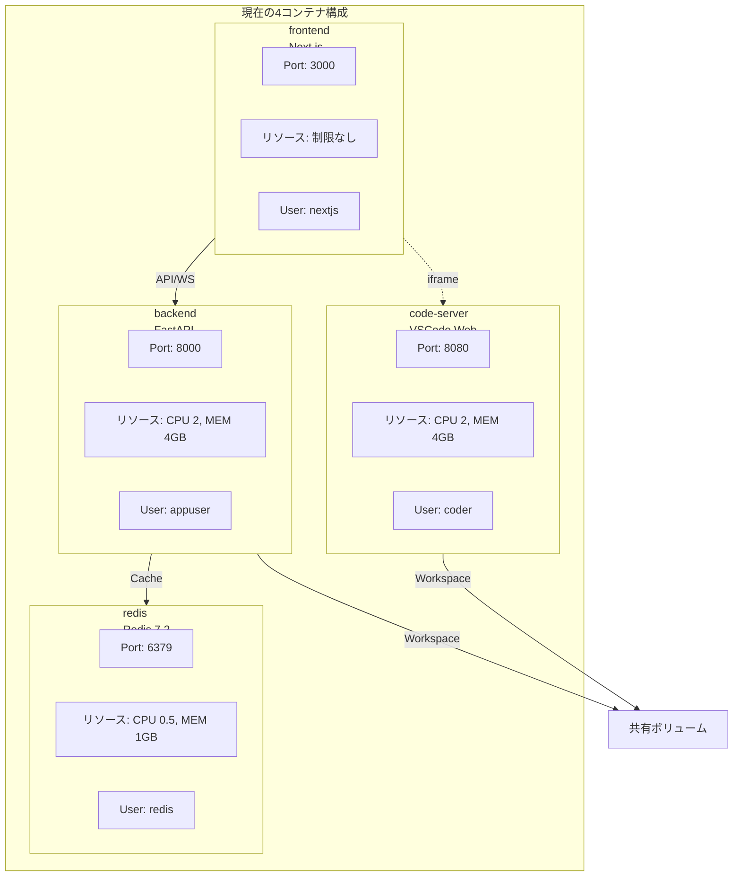

### 1.2 リソース使用状況


### 1.3 依存関係

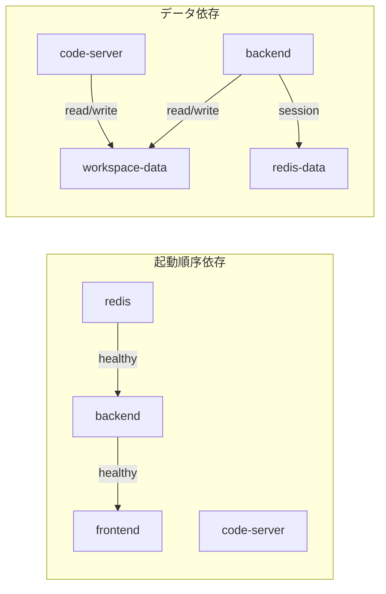

---

## 2. 単一コンテナ化のメリット・デメリット

### 2.1 メリット分析

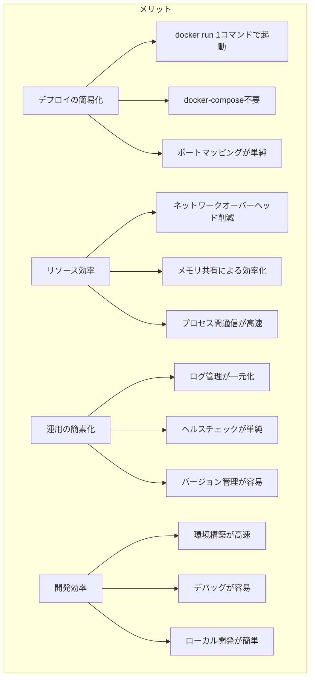

### 2.2 デメリット分析

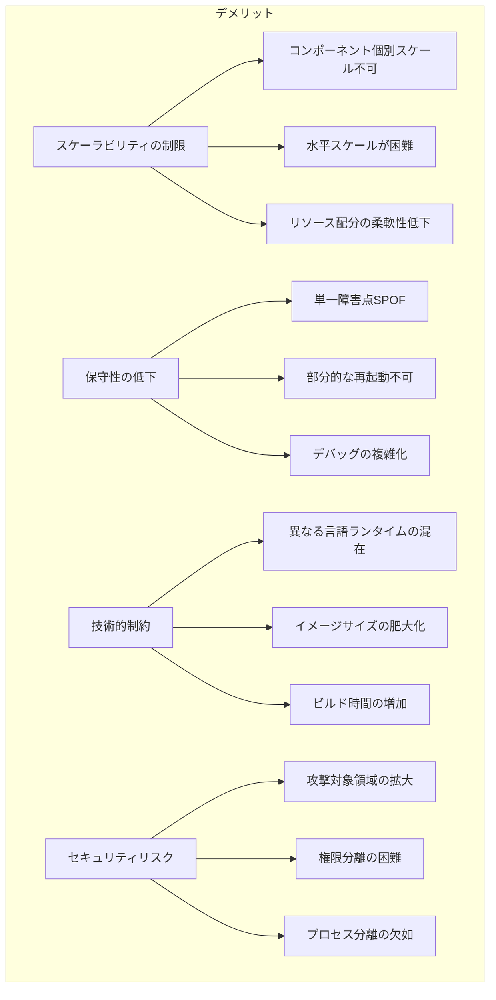

### 2.3 メリット・デメリット比較表

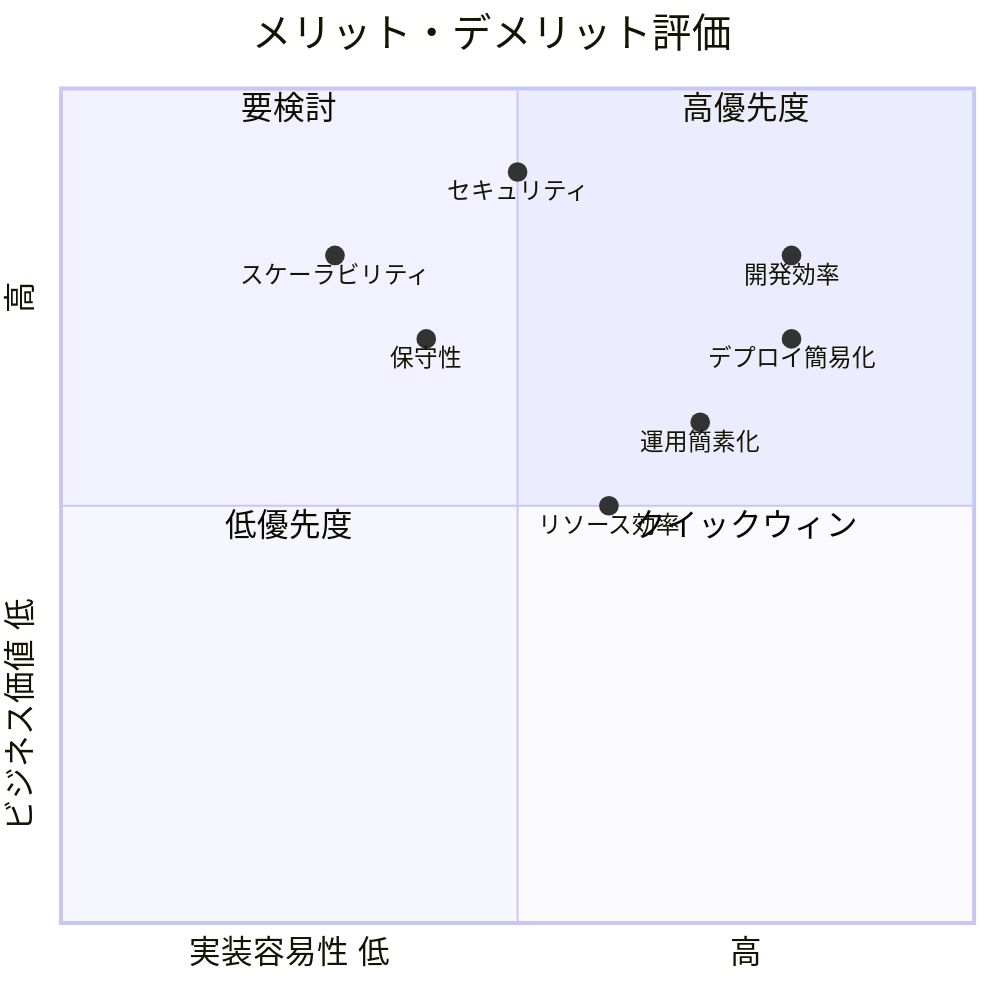

---

## 3. 技術的実現可能性評価

### 3.1 アーキテクチャパターン選択

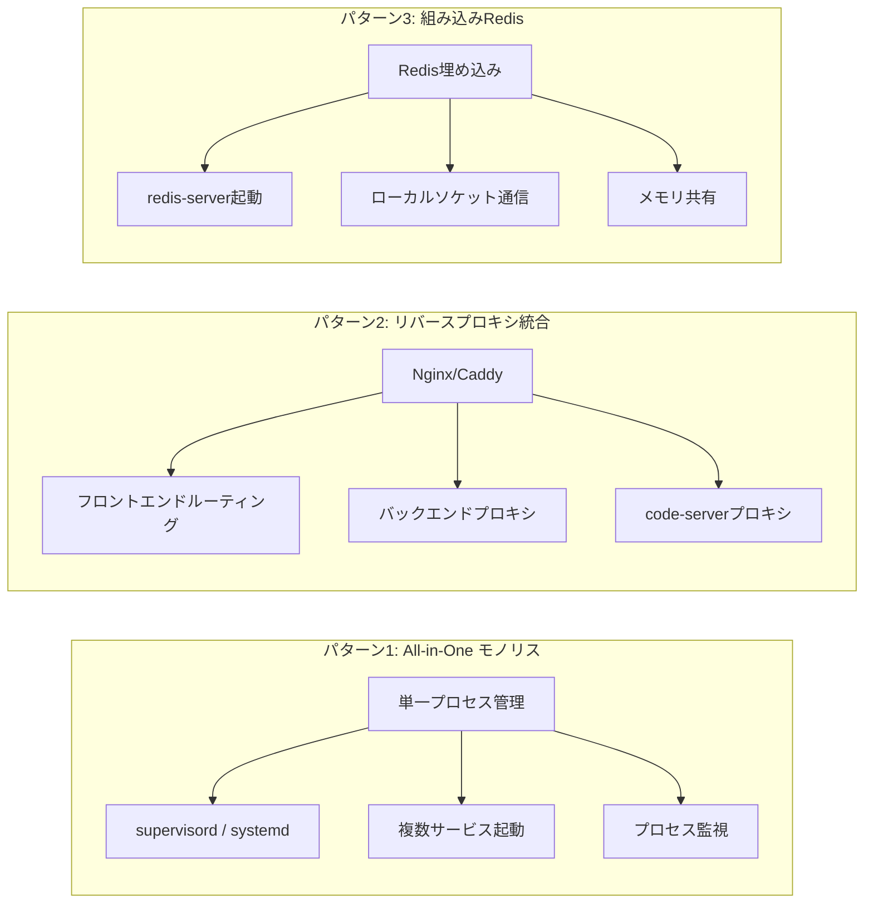

### 3.2 技術要素の互換性

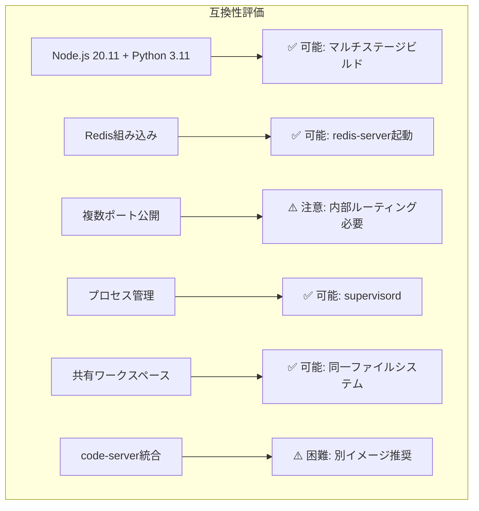

### 3.3 実現可能性スコア

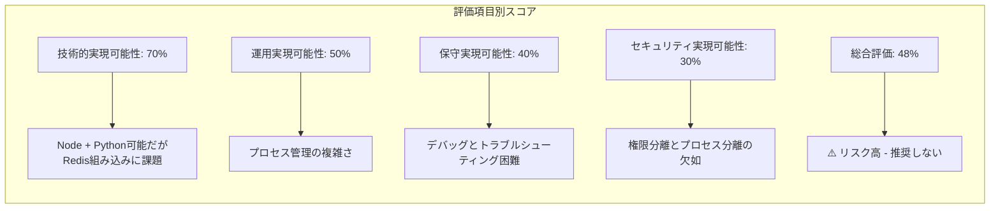

---

## 4. 単一コンテナ設計案

### 4.1 完全統合型アーキテクチャ

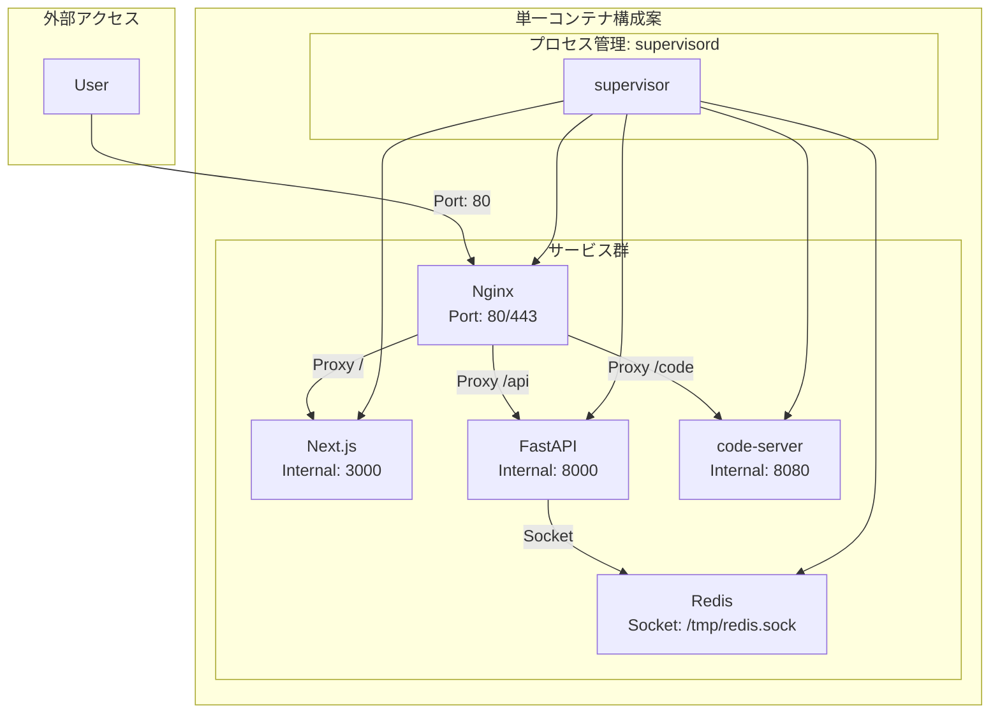

### 4.2 Dockerfile設計

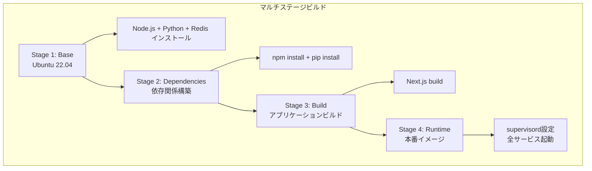

### 4.3 単一コンテナDockerfile

```dockerfile
# ============================================
# Stage 1: Base - OS + Runtime
# ============================================
FROM ubuntu:22.04 as base

ENV DEBIAN_FRONTEND=noninteractive

# Install system dependencies and runtimes
RUN apt-get update && apt-get install -y \
    # Build tools
    curl wget git build-essential ca-certificates \
    # Node.js 20.x
    && curl -fsSL https://deb.nodesource.com/setup_20.x | bash - \
    && apt-get install -y nodejs \
    # Python 3.11
    && apt-get install -y python3.11 python3.11-dev python3-pip \
    # Redis
    && apt-get install -y redis-server \
    # Nginx
    && apt-get install -y nginx \
    # Supervisor
    && apt-get install -y supervisor \
    # Cleanup
    && rm -rf /var/lib/apt/lists/*

# Set Python 3.11 as default
RUN update-alternatives --install /usr/bin/python python /usr/bin/python3.11 1 \
    && update-alternatives --install /usr/bin/python3 python3 /usr/bin/python3.11 1

# Install Poetry
RUN curl -sSL https://install.python-poetry.org | python3 - \
    && ln -s /root/.local/bin/poetry /usr/local/bin/poetry

# Create application user
RUN useradd -r -u 1000 -m -s /bin/bash appuser

# Create directories
WORKDIR /app
RUN mkdir -p /app/frontend /app/backend /app/workspace /app/logs

# ============================================
# Stage 2: Backend Dependencies
# ============================================
FROM base as backend-deps

WORKDIR /app/backend
COPY src/backend/pyproject.toml src/backend/poetry.lock ./
RUN poetry install --no-root --no-dev

# ============================================
# Stage 3: Frontend Dependencies
# ============================================
FROM base as frontend-deps

WORKDIR /app/frontend
COPY src/frontend/package.json src/frontend/package-lock.json ./
RUN npm ci --only=production

# ============================================
# Stage 4: Frontend Build
# ============================================
FROM frontend-deps as frontend-builder

COPY src/frontend/ ./
ARG NEXT_PUBLIC_API_URL=/api
ARG NEXT_PUBLIC_WS_URL=/api/ws
ENV NEXT_PUBLIC_API_URL=$NEXT_PUBLIC_API_URL
ENV NEXT_PUBLIC_WS_URL=$NEXT_PUBLIC_WS_URL
RUN npm run build

# ============================================
# Stage 5: Runtime - Final Image
# ============================================
FROM base as runtime

# Copy backend
COPY --from=backend-deps /app/backend/.venv /app/backend/.venv
COPY src/backend/app /app/backend/app
ENV PATH="/app/backend/.venv/bin:$PATH"

# Copy frontend
COPY --from=frontend-builder /app/frontend/.next /app/frontend/.next
COPY --from=frontend-builder /app/frontend/public /app/frontend/public
COPY --from=frontend-builder /app/frontend/node_modules /app/frontend/node_modules
COPY --from=frontend-builder /app/frontend/package.json /app/frontend/
COPY --from=frontend-builder /app/frontend/next.config.js /app/frontend/

# Install code-server
RUN curl -fsSL https://code-server.dev/install.sh | sh

# Copy configuration files
COPY docker/single-container/supervisord.conf /etc/supervisor/conf.d/supervisord.conf
COPY docker/single-container/nginx.conf /etc/nginx/nginx.conf
COPY docker/single-container/redis.conf /etc/redis/redis.conf

# Set permissions
RUN chown -R appuser:appuser /app/workspace /app/logs

# Expose ports
EXPOSE 80 443

# Health check
HEALTHCHECK --interval=30s --timeout=10s --start-period=60s --retries=3 \
    CMD curl -f http://localhost/api/health || exit 1

# Start supervisor
CMD ["/usr/bin/supervisord", "-c", "/etc/supervisor/conf.d/supervisord.conf"]
```

### 4.4 supervisord設定

```conf
[supervisord]
nodaemon=true
logfile=/app/logs/supervisord.log
pidfile=/var/run/supervisord.pid
user=root

[program:redis]
command=/usr/bin/redis-server /etc/redis/redis.conf
autostart=true
autorestart=true
stdout_logfile=/app/logs/redis.log
stderr_logfile=/app/logs/redis-error.log
priority=1

[program:backend]
command=/app/backend/.venv/bin/uvicorn app.main:app --host 127.0.0.1 --port 8000
directory=/app/backend
autostart=true
autorestart=true
stdout_logfile=/app/logs/backend.log
stderr_logfile=/app/logs/backend-error.log
environment=REDIS_URL="unix:///tmp/redis.sock",WORKSPACE_PATH="/app/workspace"
user=appuser
priority=2

[program:frontend]
command=/usr/bin/node /app/frontend/node_modules/next/dist/bin/next start -p 3000
directory=/app/frontend
autostart=true
autorestart=true
stdout_logfile=/app/logs/frontend.log
stderr_logfile=/app/logs/frontend-error.log
environment=NODE_ENV="production"
user=appuser
priority=3

[program:code-server]
command=/usr/bin/code-server --bind-addr 127.0.0.1:8080 --auth none /app/workspace
autostart=true
autorestart=true
stdout_logfile=/app/logs/code-server.log
stderr_logfile=/app/logs/code-server-error.log
user=appuser
priority=4

[program:nginx]
command=/usr/sbin/nginx -g 'daemon off;'
autostart=true
autorestart=true
stdout_logfile=/app/logs/nginx.log
stderr_logfile=/app/logs/nginx-error.log
priority=5
```

### 4.5 Nginx設定

```nginx
user www-data;
worker_processes auto;
pid /run/nginx.pid;

events {
    worker_connections 1024;
}

http {
    include /etc/nginx/mime.types;
    default_type application/octet-stream;

    # Logging
    access_log /app/logs/nginx-access.log;
    error_log /app/logs/nginx-error.log;

    # Frontend (Next.js)
    server {
        listen 80 default_server;
        server_name _;

        # Frontend static files and pages
        location / {
            proxy_pass http://127.0.0.1:3000;
            proxy_http_version 1.1;
            proxy_set_header Upgrade $http_upgrade;
            proxy_set_header Connection 'upgrade';
            proxy_set_header Host $host;
            proxy_cache_bypass $http_upgrade;
        }

        # Backend API
        location /api {
            proxy_pass http://127.0.0.1:8000;
            proxy_http_version 1.1;
            proxy_set_header Host $host;
            proxy_set_header X-Real-IP $remote_addr;
            proxy_set_header X-Forwarded-For $proxy_add_x_forwarded_for;
            proxy_set_header X-Forwarded-Proto $scheme;
        }

        # WebSocket
        location /api/ws {
            proxy_pass http://127.0.0.1:8000;
            proxy_http_version 1.1;
            proxy_set_header Upgrade $http_upgrade;
            proxy_set_header Connection "upgrade";
            proxy_set_header Host $host;
        }

        # code-server
        location /code/ {
            proxy_pass http://127.0.0.1:8080/;
            proxy_http_version 1.1;
            proxy_set_header Upgrade $http_upgrade;
            proxy_set_header Connection 'upgrade';
            proxy_set_header Host $host;
            proxy_cache_bypass $http_upgrade;
        }
    }
}
```

### 4.6 起動コマンド

```bash
# ビルド
docker build -f docker/single-container/Dockerfile -t claude-code:single .

# 起動
docker run -d \
  --name claude-code \
  -p 80:80 \
  -v $(pwd)/workspace:/app/workspace \
  -e ANTHROPIC_API_KEY=sk-ant-xxx \
  -e SECRET_KEY=your-secret-key \
  claude-code:single

# ログ確認
docker logs -f claude-code

# シェルアクセス
docker exec -it claude-code bash
```

---

## 5. 推奨アプローチ

### 5.1 推奨度評価

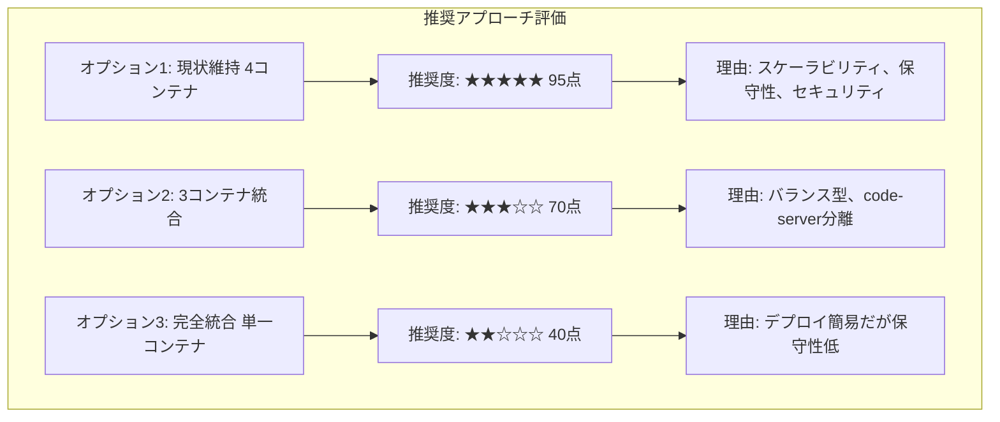

### 5.2 ユースケース別推奨

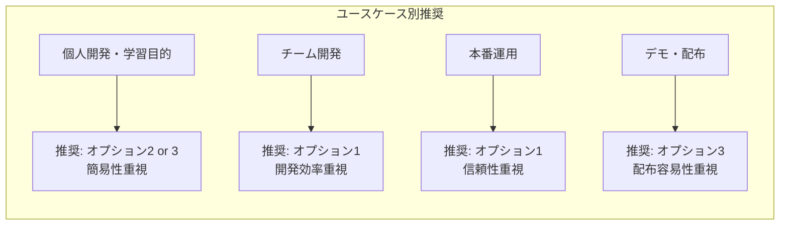

### 5.3 最終推奨: 3コンテナ統合（ハイブリッド）

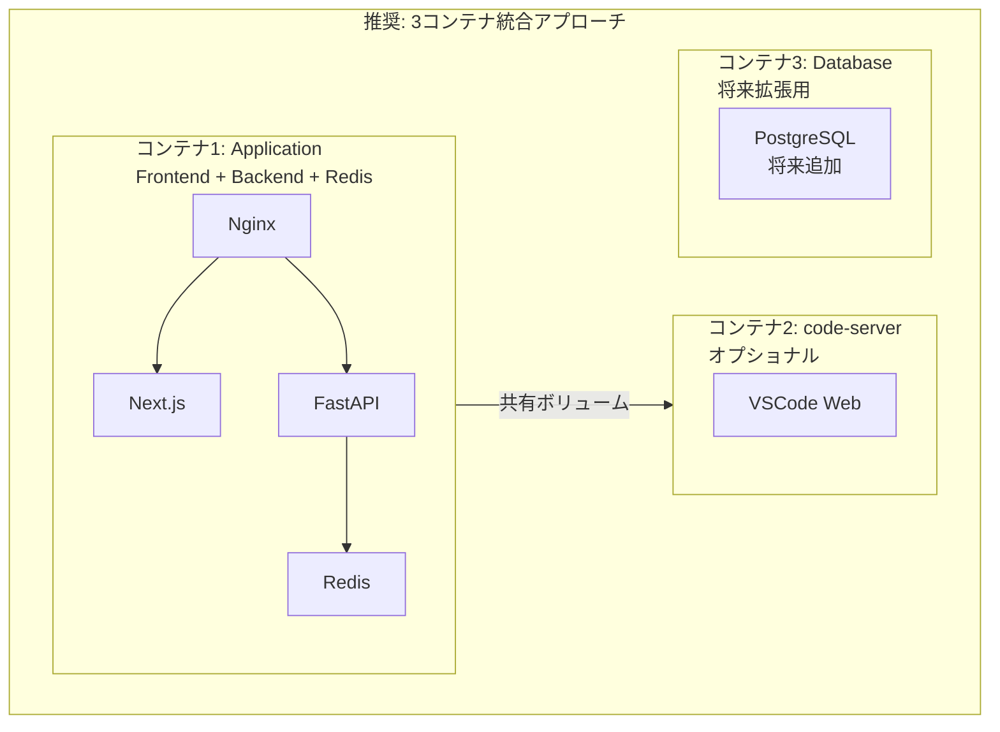

#### 3コンテナ統合のメリット

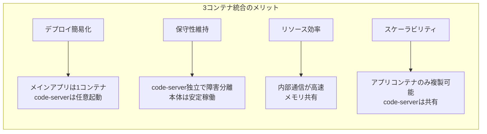

---

## 6. 実装ロードマップ

### 6.1 フェーズ別実装計画

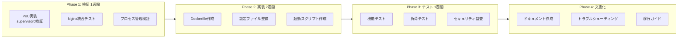

### 6.2 実装チェックリスト

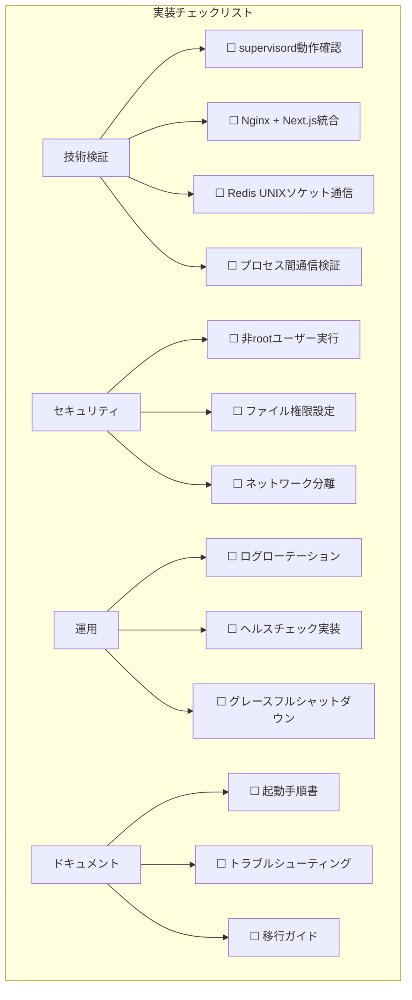

### 6.3 リスク評価と対策

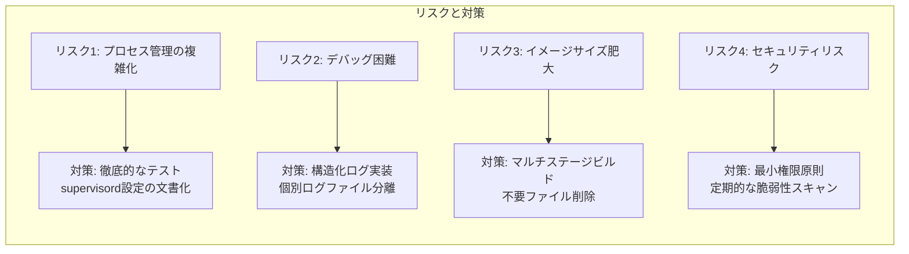

---

## 7. まとめ

### 7.1 結論

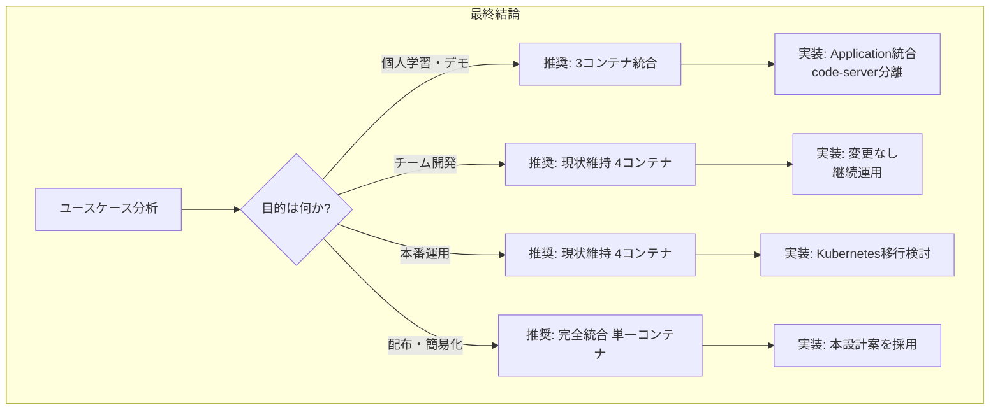

### 7.2 推奨事項

```mermaid
classDiagram
    class 推奨事項 {
        第1推奨: 現状維持 4コンテナ構成
        理由: スケーラビリティ、保守性、セキュリティのバランスが最良
        適用: チーム開発、本番運用
        ---
        第2推奨: 3コンテナ統合 ハイブリッド
        理由: デプロイ簡易化とスケーラビリティの両立
        適用: 個人開発、小規模チーム
        ---
        第3推奨: 完全統合 単一コンテナ
        理由: 最大限の簡易化、配布容易
        適用: デモ、学習目的、個人利用
        注意: 本番環境では非推奨
    }
```

### 7.3 次のアクション

1. **要件確認**: ユーザーのユースケースと優先事項を明確化
2. **PoC実装**: 推奨アプローチのプロトタイプ作成
3. **性能評価**: ベンチマーク比較（4コンテナ vs 統合）
4. **移行計画**: 採用する構成への移行手順書作成
5. **ドキュメント整備**: 運用マニュアル、トラブルシューティングガイド

---

## 付録

### A. 比較表: 4コンテナ vs 単一コンテナ

```mermaid
flowchart LR
    subgraph 4コンテナ構成
        A1[デプロイ: ★★★☆☆]
        A2[保守性: ★★★★★]
        A3[スケール: ★★★★★]
        A4[セキュリティ: ★★★★★]
        A5[リソース: ★★★☆☆]
        A6[開発速度: ★★★★☆]
    end

    subgraph 単一コンテナ構成
        B1[デプロイ: ★★★★★]
        B2[保守性: ★★☆☆☆]
        B3[スケール: ★★☆☆☆]
        B4[セキュリティ: ★★☆☆☆]
        B5[リソース: ★★★★☆]
        B6[開発速度: ★★★★★]
    end
```

### B. 実装コスト見積もり

```mermaid
pie title 実装工数配分 合計: 40時間
    "設計・検証" : 8
    "Dockerfile作成" : 10
    "設定ファイル作成" : 6
    "テスト・デバッグ" : 10
    "ドキュメント作成" : 6
```

---

**ドキュメント管理情報**

```mermaid
classDiagram
    class ドキュメント情報 {
        ファイル名: single-container-analysis.md
        保存場所: doc_draft/
        バージョン: 1.0
        作成日: 2025-12-21
        ステータス: レビュー待ち
        関連文書: docker-design.md, architecture-design.md
    }
```

---

**変更履歴**

- **v1.0 (2025-12-21)**: 初版作成 - 単一コンテナ化の分析と設計案
