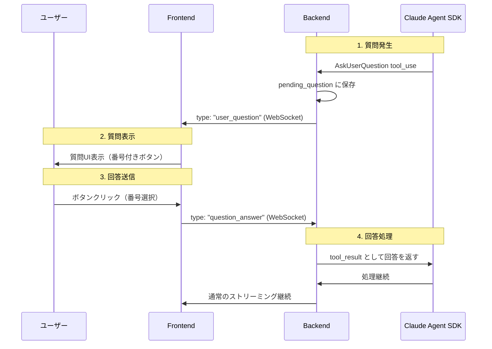

# Plan: AskUserQuestion 回答機能の実装

## 概要
Claude Agent SDK の `AskUserQuestion` ツールに対して、フロントエンドからユーザーが回答できる機能を実装する。

## 現状の問題

| 問題 | 説明 |
|------|------|
| 回答不可 | `AskUserQuestion` ツールが呼ばれても、フロントエンドから回答を送信できない |
| 重複表示 | 質問がフロントエンドで2回表示される（ストリーミング中 + メッセージ履歴） |
| Cron対象外 | Cron実行時はユーザー不在のため、AskUserQuestion は対象外とする |

## 設計

### アーキテクチャ



### バックエンド設計

#### 1. 状態管理 (SessionState に追加)

```python
@dataclass
class SessionState:
    # 既存フィールド...

    # 質問待ち状態
    pending_question: Optional[dict] = None  # AskUserQuestion の内容
    pending_tool_use_id: Optional[str] = None  # tool_use_id
    is_waiting_for_answer: bool = False  # 回答待ちフラグ
    is_interactive: bool = True  # True=フロントエンド、False=Cron
```

#### 2. WebSocket メッセージタイプ

| タイプ | 方向 | 説明 |
|--------|------|------|
| `user_question` | Server→Client | 質問をフロントエンドに送信 |
| `question_answer` | Client→Server | ユーザーの回答をバックエンドに送信 |

#### 3. user_question メッセージ形式

```json
{
  "type": "user_question",
  "tool_use_id": "toolu_xxx",
  "questions": [
    {
      "question": "どのライブラリを使用しますか？",
      "header": "Library",
      "options": [
        {"label": "React Query (推奨)", "description": "サーバー状態管理に最適"},
        {"label": "SWR", "description": "軽量な代替"},
        {"label": "Redux Toolkit Query", "description": "Redux統合"}
      ],
      "multiSelect": false
    }
  ],
  "timestamp": 1234567890
}
```

#### 4. question_answer メッセージ形式

```json
{
  "type": "question_answer",
  "tool_use_id": "toolu_xxx",
  "answers": {
    "0": "1"  // 質問インデックス -> 選択肢インデックス (または "other:カスタムテキスト")
  }
}
```

### フロントエンド設計

#### 1. 新規コンポーネント: QuestionCard

```typescript
interface QuestionCardProps {
  toolUseId: string;
  questions: Array<{
    question: string;
    header: string;
    options: Array<{ label: string; description: string }>;
    multiSelect: boolean;
  }>;
  onAnswer: (toolUseId: string, answers: Record<string, string>) => void;
  disabled?: boolean;
}
```

#### 2. UI デザイン

```
┌────────────────────────────────────────────────┐
│ Claude has a question                          │
├────────────────────────────────────────────────┤
│ Which library should we use?                   │
│                                                │
│ ┌─────────────────────────────────────────┐   │
│ │ [1] React Query (推奨)                   │   │
│ │     サーバー状態管理に最適               │   │
│ └─────────────────────────────────────────┘   │
│ ┌─────────────────────────────────────────┐   │
│ │ [2] SWR                                  │   │
│ │     軽量な代替                           │   │
│ └─────────────────────────────────────────┘   │
│ ┌─────────────────────────────────────────┐   │
│ │ [3] Redux Toolkit Query                  │   │
│ │     Redux統合                            │   │
│ └─────────────────────────────────────────┘   │
│ ┌─────────────────────────────────────────┐   │
│ │ [4] Other...                             │   │
│ └─────────────────────────────────────────┘   │
└────────────────────────────────────────────────┘
```

#### 3. 重複表示の修正

問題: `tool_use` として表示される + 専用UIとして表示される

解決策:
- `tool_use` ブロックで `name === "AskUserQuestion"` の場合は、既存のToolUseCardではなくQuestionCardを表示
- ストリーミング完了後のメッセージ履歴でも同様に判定

### 実装ステップ

| Step | 内容 | ファイル |
|------|------|----------|
| 1 | WebSocket型定義追加 | `src/frontend/src/types/websocket.ts` |
| 2 | SessionState拡張 | `src/backend/app/api/websocket/handlers.py` |
| 3 | AskUserQuestion検出・送信 | `src/backend/app/api/websocket/handlers.py` |
| 4 | question_answer処理 | `src/backend/app/api/websocket/handlers.py` |
| 5 | QuestionCardコンポーネント | `src/frontend/src/components/chat/QuestionCard.tsx` |
| 6 | useWebSocket拡張 | `src/frontend/src/hooks/useWebSocket.ts` |
| 7 | ChatContainer統合 | `src/frontend/src/components/chat/ChatContainer.tsx` |
| 8 | 重複表示修正 | 各表示コンポーネント |

## Expected Outcomes (定量的)

| 項目 | 目標 |
|------|------|
| AskUserQuestion回答機能 | 動作すること |
| 重複表示 | 解消されること |
| 番号ボタン | 1から採番されて表示されること |
| Cron | AskUserQuestion非対応（フラグ管理） |

## Risks & Mitigation

| リスク | 対策 |
|--------|------|
| SDK側の仕様変更 | Claude Agent SDKのAskUserQuestion仕様を確認 |
| 複数質問の同時処理 | 1つずつ順番に処理する設計 |
| タイムアウト | 回答待ち時間に制限を設ける（オプション） |
