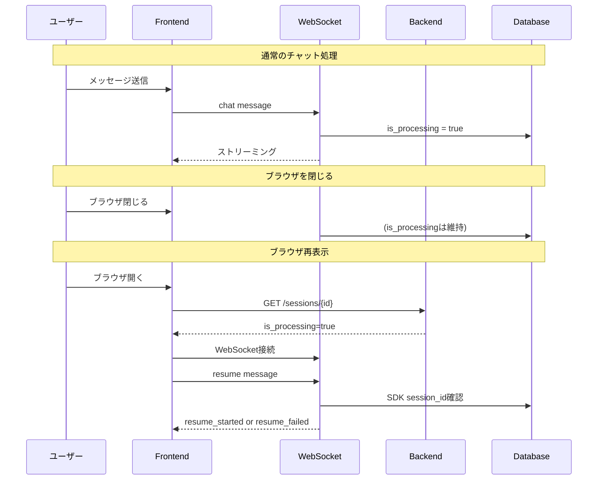

# Do: チャット履歴永続化とストリーム再開

## Implementation Log (時系列)

### 調査フェーズ (完了)
- 現状のメッセージ保存・表示フローを調査
- 問題の根本原因を特定:
  - DBの`messages`テーブルの`content`カラムにJSONを文字列として保存
  - フロントエンドはContentBlock[]形式を期待しているが、APIは文字列を返す
  - セッションの処理状態（processing）が永続化されていない

### Phase 1: フロントエンド履歴表示修正 (完了)

**変更ファイル:**
- `src/frontend/src/hooks/useChat.ts`

**変更内容:**
- `transformApiMessage`関数を堅牢化
- ContentBlockの妥当性チェック関数`isValidContentBlock`を追加
- JSON解析失敗時のフォールバック処理を改善
- 空コンテンツ、単一オブジェクト、配列のそれぞれを適切に処理

### Phase 2: セッション処理状態の永続化 (完了)

**変更ファイル:**
- `src/backend/app/models/database.py` - SessionModelに`is_processing`, `processing_started_at`カラム追加
- `src/backend/app/models/sessions.py` - Pydanticモデルに対応フィールド追加
- `src/backend/app/schemas/response.py` - SessionResponseに処理状態フィールド追加
- `src/backend/app/core/session_manager.py` - 処理状態更新メソッド追加
  - `set_processing(session_id, is_processing)`
  - `get_processing_state(session_id)`
  - `reset_stale_processing_sessions(timeout_minutes)`
- `src/backend/app/api/websocket/handlers.py` - DB処理状態の更新を追加

**マイグレーション:**
- `migrations/add_processing_state.sql` - DBスキーマ変更SQL

### Phase 3: ストリーム再開機能の実装 (完了)

**バックエンド変更:**
- `src/backend/app/api/websocket/handlers.py`
  - `_handle_resume`関数追加
  - resumeメッセージタイプの処理
  - タイムアウトチェック（30分）
  - SDK session_idの検証

**フロントエンド変更:**
- `src/frontend/src/types/session.ts` - Session型に処理状態フィールド追加
- `src/frontend/src/hooks/useWebSocket.ts`
  - `requestResume`メソッド追加
  - `resume_started`, `resume_not_needed`, `resume_failed`メッセージ処理
- `src/frontend/src/hooks/useChat.ts`
  - セッション取得時に処理状態をチェック
  - WebSocket接続後に自動でresumeをリクエスト

## データフロー

## 技術的決定

| 決定事項 | 選択 | 理由 |
|---------|------|------|
| DB処理状態の永続化方法 | is_processing + processing_started_at | シンプルで、タイムアウト処理も可能 |
| タイムアウト時間 | 30分 | 長時間処理を考慮しつつ、リソースリーク防止 |
| ストリーム再開の自動/手動 | 自動 | UX向上のため、接続時に自動でresumeをリクエスト |

## 既知の制限事項

1. **完全なストリーム再開は未実装**: Claude SDKの制約により、途中からの再開は不可。session_idを使用した新規クエリで過去のコンテキストは維持される。

2. **処理中の途中結果は未保存**: 中断時の部分レスポンスのみ保存（[PARTIAL]プレフィックス付き）

## 次のステップ

- [ ] DBマイグレーション実行
- [ ] バックエンドビルド・テスト
- [ ] フロントエンドビルド・テスト
- [ ] 統合テスト
