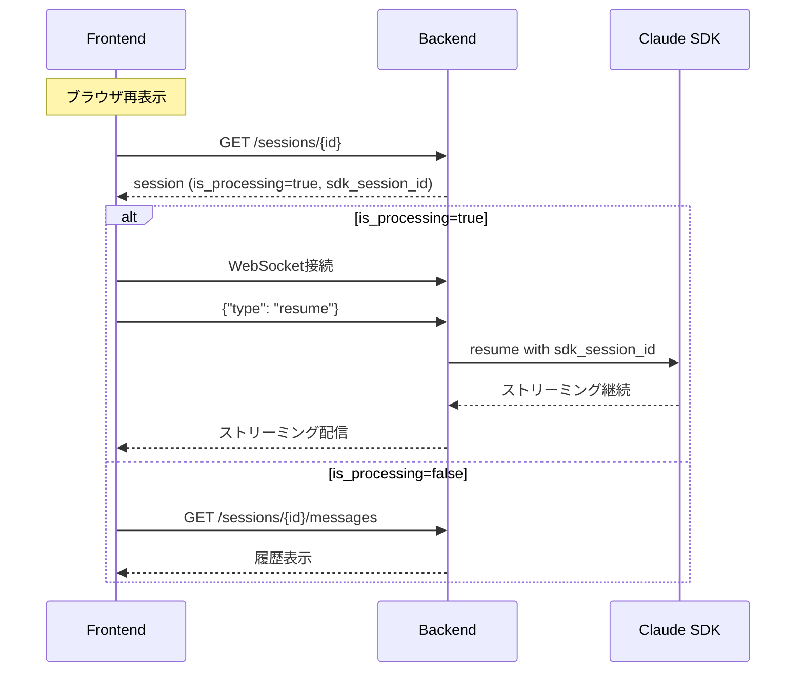

# Plan: チャット履歴永続化とストリーム再開

## Hypothesis

ブラウザを閉じて再表示すると履歴が正しく表示されない問題を解決する。

**原因分析:**
1. DBの`messages`テーブルの`content`カラムにJSONを文字列として保存
2. フロントエンドはContentBlock[]形式を期待しているが、APIは文字列を返す
3. セッションの処理状態（processing）が永続化されていない

**解決方針:**
- メッセージ構造をそのまま保存・復元可能にする
- セッション処理状態を永続化し、ストリーム再開を実現する

## Architecture Design

### 変更なしアプローチ（スキーマ変更最小）

現在のDBスキーマを活かし、フロントエンド側でJSONパースを適切に行う。

```
既存スキーマ:
  messages.content: TEXT (JSONまたはプレーンテキスト)

フロー:
1. バックエンド: ContentBlock[]をJSON文字列として保存（現状通り）
2. API: content文字列をそのまま返す（現状通り）
3. フロントエンド: content文字列をパースしてContentBlock[]に変換
```

### セッション処理状態の永続化

```
sessions テーブル拡張:
  - is_processing: Boolean (処理中フラグ)
  - processing_started_at: DateTime (処理開始時刻)
```

### ストリーム再開の仕組み



## Expected Outcomes (定量的)

| メトリック | 現状 | 目標 |
|-----------|------|------|
| 履歴表示成功率 | 0% (ツール含むメッセージ) | 100% |
| ストリーム再開対応 | 未対応 | 対応 |
| DBスキーマ変更 | - | 最小限（2カラム追加） |

## Implementation Steps

### Phase 1: フロントエンド履歴表示修正
1. API応答のcontentをパースする関数を実装
2. Message型への変換ロジックを修正

### Phase 2: セッション処理状態の永続化
1. SessionModelに`is_processing`, `processing_started_at`カラム追加
2. WebSocketハンドラーで処理開始/終了時にDB更新
3. セッションAPIで処理状態を返す

### Phase 3: ストリーム再開機能
1. フロント: セッション表示時に処理状態をチェック
2. バックエンド: resume WebSocketメッセージタイプを追加
3. SDK session_id を使用してストリーム再開

## Risks & Mitigation

| リスク | 対策 |
|-------|------|
| SDKセッション再開の失敗 | フォールバックとして履歴表示 + 新規メッセージ送信を許可 |
| 処理状態の不整合 | タイムアウト処理を実装（30分後に自動リセット） |
| 既存データとの互換性 | JSONパース失敗時はプレーンテキストとして表示 |
