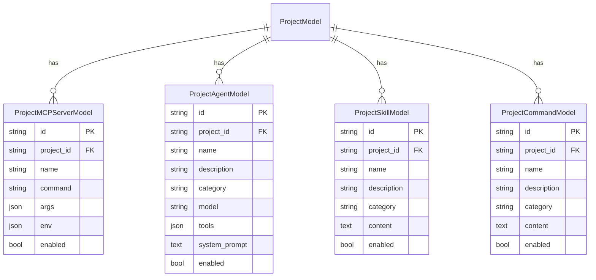

# Act: DB Config Management

## Summary

Successfully implemented database-based management for MCP Servers, Agents, Skills, and Commands with project-level association.

## Architecture Decision



## API Endpoints Created

### MCP Servers
- `GET /api/projects/{project_id}/mcp-servers` - List
- `POST /api/projects/{project_id}/mcp-servers` - Create
- `GET /api/projects/{project_id}/mcp-servers/{id}` - Get
- `PUT /api/projects/{project_id}/mcp-servers/{id}` - Update
- `DELETE /api/projects/{project_id}/mcp-servers/{id}` - Delete

### Agents
- `GET /api/projects/{project_id}/agents` - List
- `POST /api/projects/{project_id}/agents` - Create
- `GET /api/projects/{project_id}/agents/{id}` - Get
- `PUT /api/projects/{project_id}/agents/{id}` - Update
- `DELETE /api/projects/{project_id}/agents/{id}` - Delete

### Skills
- `GET /api/projects/{project_id}/skills` - List
- `POST /api/projects/{project_id}/skills` - Create
- `GET /api/projects/{project_id}/skills/{id}` - Get
- `PUT /api/projects/{project_id}/skills/{id}` - Update
- `DELETE /api/projects/{project_id}/skills/{id}` - Delete

### Commands
- `GET /api/projects/{project_id}/commands` - List
- `POST /api/projects/{project_id}/commands` - Create
- `GET /api/projects/{project_id}/commands/{id}` - Get
- `PUT /api/projects/{project_id}/commands/{id}` - Update
- `DELETE /api/projects/{project_id}/commands/{id}` - Delete

### Aggregate
- `GET /api/projects/{project_id}/config` - Get all enabled config for AgentSdkClient

## Files Modified/Created

| File | Type | Purpose |
|------|------|---------|
| `models/database.py` | Modified | Added 4 new models |
| `schemas/project_config.py` | New | Pydantic schemas |
| `services/project_config_service.py` | New | CRUD service |
| `api/routes/project_config.py` | New | API endpoints |
| `main.py` | Modified | Router registration |
| `api/websocket/handlers.py` | Modified | DB config loading |

## SDK Integration Details

### ClaudeAgentOptions 設定

```python
from claude_agent_sdk.types import McpStdioServerConfig, AgentDefinition

# MCP Servers
mcp_servers_config = {
    "name": McpStdioServerConfig(
        type="stdio",
        command="command",
        args=["arg1", "arg2"],
        env={"KEY": "value"},
    )
}

# Agents
agents_config = {
    "name": AgentDefinition(
        description="description",
        prompt="system_prompt",
        tools=["Read", "Write"],
        model="sonnet",
    )
}

# Options
options = ClaudeAgentOptions(
    mcp_servers=mcp_servers_config,
    agents=agents_config,
    setting_sources=["project"],  # Skills/Commands をファイルから読み込み
)
```

### Skills/Commands ファイル同期

- CRUD操作時に自動的にファイルシステムに同期
- `ProjectConfigService.sync_skills_to_filesystem()`
- `ProjectConfigService.sync_commands_to_filesystem()`
- ワークスペースパス: `{workspace_base}/{project_id}/.claude/`

## Learnings

1. **Skills/Commands はファイルベース**: SDK はファイルシステムから読み込む仕様のため、DB変更時にファイル同期が必要
2. **setting_sources パラメータ**: `["project"]` を指定することでワークスペース内の `.claude/` ディレクトリから設定を読み込む
3. **"Skill" ツールの許可**: Skills を使用するには `allowed_tools` に `"Skill"` を追加する必要がある

## Next Steps

1. Frontend UI for managing MCP/Agent/Skill/Command
2. Import/Export functionality for project configs
3. Template-based project initialization
