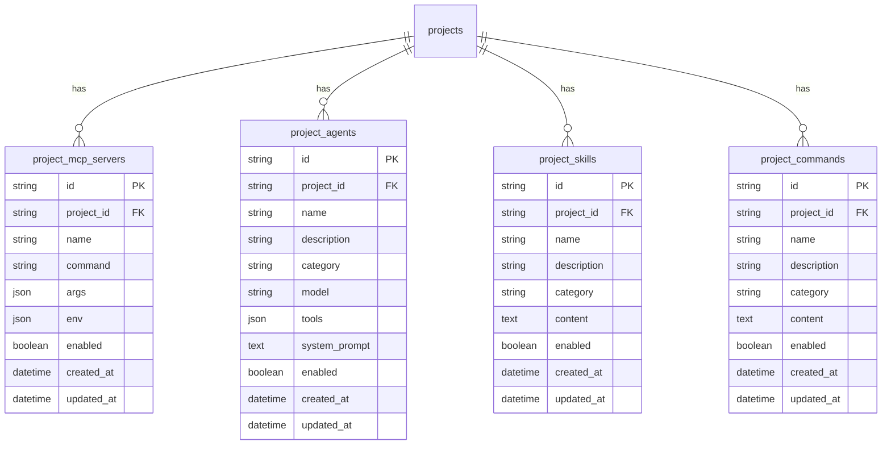

# Plan: MCP/Agent/Skill/Command DB管理

## 仮説
ファイルベース(`.mcp.json`, `.agents.json`等)で管理していた設定をデータベース管理に変更することで:
- プロジェクト単位での設定管理が可能
- CRUD APIで動的に設定変更可能
- AgentSdkClientに設定をJSON形式で渡してプロジェクト固有の機能を利用可能

## Expected Outcomes

| Metric | Expected |
|--------|----------|
| Database Models | 4つ (MCP, Agent, Skill, Command) |
| CRUD Endpoints | 各エンティティに5エンドポイント |
| AgentSdkClient統合 | ProjectConfigをJSON形式で渡す |

## Architecture Design

### Database Models



### API Endpoints

#### MCP Servers
| Method | Path | Description |
|--------|------|-------------|
| GET | /projects/{id}/mcp-servers | 一覧取得 |
| POST | /projects/{id}/mcp-servers | 作成 |
| GET | /projects/{id}/mcp-servers/{mcp_id} | 詳細取得 |
| PUT | /projects/{id}/mcp-servers/{mcp_id} | 更新 |
| DELETE | /projects/{id}/mcp-servers/{mcp_id} | 削除 |

#### Agents (同様のパターン)
| Method | Path | Description |
|--------|------|-------------|
| GET | /projects/{id}/agents | 一覧取得 |
| POST | /projects/{id}/agents | 作成 |
| GET | /projects/{id}/agents/{agent_id} | 詳細取得 |
| PUT | /projects/{id}/agents/{agent_id} | 更新 |
| DELETE | /projects/{id}/agents/{agent_id} | 削除 |

#### Skills (同様のパターン)
#### Commands (同様のパターン)

### AgentSdkClient統合

```python
# chat_service.pyでの使用イメージ
project_config = await config_service.get_project_config(project_id)

# JSON形式でAgentに渡す
options = {
    "mcp_servers": [server.to_dict() for server in project_config.mcp_servers],
    "agents": [agent.to_dict() for agent in project_config.agents],
    "skills": [skill.to_dict() for skill in project_config.skills],
    "commands": [cmd.to_dict() for cmd in project_config.commands],
}

# システムプロンプトに設定情報を含める
enhanced_system_prompt = generate_system_prompt(options)
```

## Risks & Mitigation

| Risk | Mitigation |
|------|------------|
| 既存ファイルベース設定との互換性 | 初回起動時にファイルからDBにインポート機能 |
| パフォーマンス | プロジェクト設定をキャッシュ |
| 認証 | 既存の権限チェック機能を再利用 |

## Implementation Order

1. Database Models追加 (`models/database.py`)
2. Pydanticスキーマ作成 (`schemas/project_config.py`)
3. CRUD Service作成 (`services/project_config_service.py`)
4. API Routes作成 (`api/routes/project_config.py`)
5. chat_service修正 (DB設定読み込み)
6. テスト実行
